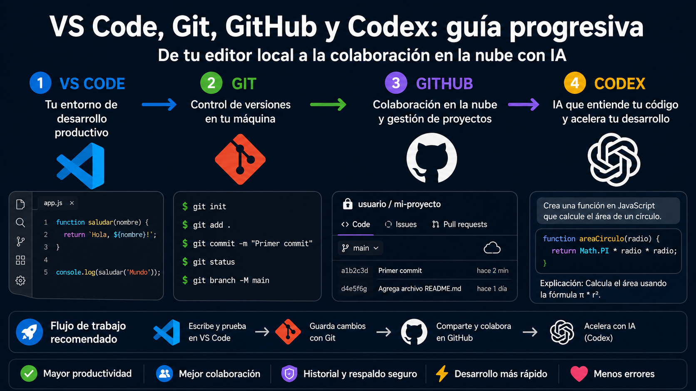

<p align="center">
  
</p>


# VS Code, Git, GitHub y Codex: guía progresiva para empezar desde cero

## Índice

1. [Idea rápida, sin tecnicismos](#1-idea-rápida-sin-tecnicismos)
2. [¿Qué es VS Code?](#2-qué-es-vs-code)
3. [¿Qué NO es VS Code?](#3-qué-no-es-vs-code)
4. [¿Qué es una carpeta de proyecto?](#4-qué-es-una-carpeta-de-proyecto)
5. [¿Qué es Git?](#5-qué-es-git)
6. [Git explicado con una analogía sencilla](#6-git-explicado-con-una-analogía-sencilla)
7. [Tres conceptos básicos de Git](#7-tres-conceptos-básicos-de-git)
8. [Comandos mínimos de Git](#8-comandos-mínimos-de-git)
9. [¿Qué es GitHub?](#9-qué-es-github)
10. [Diferencia entre Git y GitHub](#10-diferencia-entre-git-y-github)
11. [Cómo se integra VS Code con Git](#11-cómo-se-integra-vs-code-con-git)
12. [Cómo se integra VS Code con GitHub](#12-cómo-se-integra-vs-code-con-github)
13. [¿Qué es clonar un repositorio?](#13-qué-es-clonar-un-repositorio)
14. [¿Qué es un push?](#14-qué-es-un-push)
15. [¿Qué es un pull?](#15-qué-es-un-pull)
16. [¿Qué es una rama?](#16-qué-es-una-rama)
17. [¿Qué es Codex?](#17-qué-es-codex)
18. [Codex explicado sin tecnicismos](#18-codex-explicado-sin-tecnicismos)
19. [Qué puede hacer Codex](#19-qué-puede-hacer-codex)
20. [Qué NO puede hacer Codex de forma fiable](#20-qué-no-puede-hacer-codex-de-forma-fiable)
21. [Riesgo principal: aceptar cambios sin mirar](#21-riesgo-principal-aceptar-cambios-sin-mirar)
22. [Buenas prácticas al usar Codex con VS Code y GitHub](#22-buenas-prácticas-al-usar-codex-con-vs-code-y-github)
23. [Flujo recomendado para principiantes](#23-flujo-recomendado-para-principiantes)
24. [Flujo recomendado para usuarios intermedios](#24-flujo-recomendado-para-usuarios-intermedios)
25. [Qué es una pull request](#25-qué-es-una-pull-request)
26. [Cómo pedir bien las cosas a Codex](#26-cómo-pedir-bien-las-cosas-a-codex)
27. [Prompt recomendado para revisar un proyecto](#27-prompt-recomendado-para-revisar-un-proyecto)
28. [Prompt recomendado para modificar código de forma controlada](#28-prompt-recomendado-para-modificar-código-de-forma-controlada)
29. [Prompt recomendado antes de hacer commit](#29-prompt-recomendado-antes-de-hacer-commit)
30. [Prompt recomendado para errores de terminal](#30-prompt-recomendado-para-errores-de-terminal)
31. [Integración completa: VS Code + Git + GitHub + Codex](#31-integración-completa-vs-code--git--github--codex)
32. [Qué puede hacer una persona sin conocimientos IT con este flujo](#32-qué-puede-hacer-una-persona-sin-conocimientos-it-con-este-flujo)
33. [Qué puede hacer una persona avanzada con este flujo](#33-qué-puede-hacer-una-persona-avanzada-con-este-flujo)
34. [Errores frecuentes en clase](#34-errores-frecuentes-en-clase)
35. [Checklist antes de subir cambios a GitHub](#35-checklist-antes-de-subir-cambios-a-github)
36. [Checklist antes de pedir cambios a Codex](#36-checklist-antes-de-pedir-cambios-a-codex)
37. [Modelo mental final](#37-modelo-mental-final)
38. [Resumen en una frase](#38-resumen-en-una-frase)
39. [Mini glosario](#39-mini-glosario)
40. [Ejercicio práctico recomendado para clase](#40-ejercicio-práctico-recomendado-para-clase)
41. [Mensaje clave para el alumnado](#41-mensaje-clave-para-el-alumnado)

---

## 1. Idea rápida, sin tecnicismos

Imagina que vas a construir una página web, una aplicación o un pequeño proyecto de programación.

- **VS Code** es tu mesa de trabajo.
- **Git** es el sistema que guarda el historial de lo que vas cambiando.
- **GitHub** es el sitio online donde subes tu proyecto para guardarlo, compartirlo o colaborar.
- **Codex** es un asistente de IA que puede ayudarte a entender, escribir, modificar y revisar código.

Una forma sencilla de verlo:

```text
VS Code  = donde trabajas
Git      = el historial de cambios
GitHub   = la nube donde guardas y compartes el proyecto
Codex    = el asistente que te ayuda a programar
```

Pero hay algo importante: **Codex no sustituye saber qué estás haciendo**. Puede acelerar mucho, pero también puede equivocarse, tocar archivos que no debe, romper una funcionalidad o inventar una solución que parece buena pero no lo es.

---

## 2. ¿Qué es VS Code?

**Visual Studio Code**, normalmente llamado **VS Code**, es un editor de código.

No es exactamente “un Word para programar”, aunque para una persona nueva puede parecerlo al principio. Es más bien un entorno de trabajo donde puedes:

- abrir carpetas de proyectos;
- editar archivos de código;
- ver errores;
- usar una terminal integrada;
- instalar extensiones;
- conectarte con Git y GitHub;
- ejecutar proyectos;
- usar asistentes de IA como Copilot o Codex.

VS Code no es el programa final que estás creando. Es la herramienta desde la que trabajas.

Ejemplo:

```text
Proyecto web
├── index.html
├── styles.css
├── script.js
└── README.md
```

VS Code te permite abrir esa carpeta, ver los archivos, editarlos y trabajar con ellos de forma ordenada.

---

## 3. ¿Qué NO es VS Code?

VS Code no es:

- una inteligencia artificial por sí mismo;
- una página web;
- un servidor;
- GitHub;
- una base de datos;
- una herramienta mágica que arregla cualquier error;
- una garantía de que el código funcione.

VS Code es el entorno. Lo que ocurra dentro depende de:

- los archivos del proyecto;
- las extensiones instaladas;
- los comandos que ejecutes;
- la configuración del sistema;
- el conocimiento del usuario;
- las decisiones que tome la IA si se usa Codex o Copilot.

---

## 4. ¿Qué es una carpeta de proyecto?

Cuando trabajamos con VS Code normalmente no abrimos archivos sueltos, sino una **carpeta de proyecto**.

Una carpeta de proyecto contiene todos los elementos necesarios para que el proyecto funcione.

Ejemplo sencillo de una web:

```text
mi-web/
├── index.html
├── styles.css
├── script.js
└── README.md
```

Ejemplo de una API con Python:

```text
mi-api/
├── app/
│   └── main.py
├── requirements.txt
├── README.md
└── .gitignore
```

La carpeta es importante porque Git, GitHub y Codex suelen trabajar sobre el proyecto completo, no sólo sobre un archivo aislado.

---

## 5. ¿Qué es Git?

**Git** es un sistema de control de versiones.

Dicho de forma simple: Git permite guardar “fotografías” del estado de tu proyecto a lo largo del tiempo.

Cada vez que haces un cambio importante, puedes guardar una versión. Esa versión se llama **commit**.

Ejemplo:

```text
Commit 1: creo la estructura inicial de la web
Commit 2: cambio los colores
Commit 3: añado una sección de contacto
Commit 4: corrijo un error del menú
```

Gracias a Git puedes:

- ver qué archivos han cambiado;
- comparar versiones;
- volver atrás si rompes algo;
- trabajar con ramas;
- colaborar con otras personas;
- sincronizar el proyecto con GitHub.

---

## 6. Git explicado con una analogía sencilla

Imagina que estás escribiendo un documento importante.

Sin Git, podrías acabar con algo así:

```text
trabajo_final.docx
trabajo_final_bueno.docx
trabajo_final_bueno_ahora_si.docx
trabajo_final_definitivo.docx
trabajo_final_definitivo_2.docx
```

Con Git, en vez de duplicar archivos, guardas versiones ordenadas:

```text
Versión 1: estructura inicial
Versión 2: añado introducción
Versión 3: corrijo errores
Versión 4: añado conclusiones
```

Git evita el caos de versiones manuales.

---

## 7. Tres conceptos básicos de Git

### 7.1. Working directory

Es tu carpeta de trabajo actual. Ahí están los archivos que estás editando.

### 7.2. Staging area

Es una zona intermedia donde preparas los cambios que quieres guardar.

En VS Code suele aparecer como **Source Control**. Puedes seleccionar qué archivos quieres incluir en el próximo commit.

### 7.3. Commit

Es una versión guardada del proyecto.

Un commit debe tener un mensaje claro, por ejemplo:

```text
Añade sección de contacto a la página principal
```

No conviene escribir mensajes inútiles como:

```text
cosas
cambios
arreglo
asdf
```

---

## 8. Comandos mínimos de Git

Aunque VS Code permite hacer muchas acciones con botones, conviene conocer los comandos básicos.

### Ver el estado del proyecto

```bash
git status
```

Muestra qué archivos han cambiado.

### Preparar cambios

```bash
git add .
```

Añade todos los cambios al área de preparación.

### Guardar una versión

```bash
git commit -m "Mensaje claro del cambio"
```

Crea un commit con los cambios preparados.

### Subir cambios a GitHub

```bash
git push
```

Envía los commits locales al repositorio remoto.

### Descargar cambios desde GitHub

```bash
git pull
```

Trae cambios del repositorio remoto a tu equipo.

---

## 9. ¿Qué es GitHub?

**GitHub** es una plataforma online para alojar repositorios Git.

Un repositorio es la carpeta de tu proyecto gestionada por Git.

Git vive en tu ordenador. GitHub vive en internet.

```text
Tu ordenador
└── Proyecto con Git

GitHub
└── Copia online del proyecto
```

GitHub sirve para:

- guardar una copia remota del proyecto;
- compartir código;
- trabajar en equipo;
- revisar cambios;
- crear issues;
- publicar documentación;
- desplegar webs sencillas con GitHub Pages;
- conectar herramientas como VS Code, Codex o sistemas de integración continua.

---

## 10. Diferencia entre Git y GitHub

Esta confusión es muy común.

| Concepto | Qué es | Dónde está |
|---|---|---|
| Git | Sistema de control de versiones | En tu ordenador |
| GitHub | Plataforma para alojar repositorios Git | En internet |
| VS Code | Editor donde trabajas | En tu ordenador |
| Codex | Asistente de IA para código | En IDE, terminal o nube, según configuración |

Git no necesita GitHub para funcionar. Puedes usar Git localmente sin subir nada a internet.

GitHub sí necesita Git, porque GitHub aloja repositorios Git.

---

## 11. Cómo se integra VS Code con Git

VS Code detecta si una carpeta tiene Git activado.

Cuando abres una carpeta con un repositorio Git, VS Code puede mostrar:

- archivos modificados;
- archivos nuevos;
- archivos eliminados;
- diferencias entre versiones;
- opción para hacer commit;
- opción para hacer push y pull;
- ramas del proyecto.

En el lateral izquierdo aparece una sección llamada normalmente **Source Control**.

Desde ahí puedes hacer parte del flujo Git sin escribir comandos.

Flujo típico:

```text
1. Modifico archivos en VS Code
2. Reviso cambios en Source Control
3. Preparo cambios
4. Escribo mensaje de commit
5. Hago commit
6. Hago push a GitHub
```

---

## 12. Cómo se integra VS Code con GitHub

VS Code puede conectarse con GitHub para:

- clonar repositorios;
- publicar un repositorio local en GitHub;
- sincronizar cambios;
- gestionar ramas;
- revisar pull requests;
- usar extensiones relacionadas con GitHub;
- trabajar con GitHub Codespaces en algunos escenarios.

Ejemplo de flujo básico:

```text
GitHub → Copiar URL del repositorio
VS Code → Clone Repository
VS Code → Editar archivos
VS Code → Commit
VS Code → Push
GitHub → Ver cambios online
```

---

## 13. ¿Qué es clonar un repositorio?

Clonar significa descargar una copia de un repositorio desde GitHub a tu ordenador.

Ejemplo:

```bash
git clone https://github.com/usuario/proyecto.git
```

Después de clonar, tienes una carpeta local conectada con el repositorio remoto.

```text
GitHub
└── proyecto

Tu ordenador
└── proyecto clonado
```

---

## 14. ¿Qué es un push?

**Push** significa subir tus commits locales a GitHub.

```bash
git push
```

Lo importante: GitHub no recibe todos tus cambios automáticamente. Primero debes hacer commit y luego push.

```text
Editar archivo → git add → git commit → git push
```

---

## 15. ¿Qué es un pull?

**Pull** significa traer cambios desde GitHub a tu ordenador.

```bash
git pull
```

Esto es importante cuando:

- trabajas desde varios ordenadores;
- colaboras con más personas;
- has editado algo directamente en GitHub;
- Codex u otra herramienta ha generado cambios en remoto.

---

## 16. ¿Qué es una rama?

Una **rama** es una línea de trabajo separada.

La rama principal suele llamarse `main`.

Ejemplo:

```text
main
├── versión estable del proyecto

feature/contacto
├── cambios para añadir formulario de contacto
```

Las ramas sirven para probar cambios sin romper la versión principal.

Para alumnado inicial, basta con entender esto:

> La rama `main` debe mantenerse lo más limpia posible. Los experimentos conviene hacerlos en ramas separadas.

---

## 17. ¿Qué es Codex?

**Codex** es un asistente de programación con IA de OpenAI.

Puede ayudarte a trabajar con código de varias formas:

- explicar archivos;
- proponer cambios;
- escribir funciones;
- modificar varios archivos;
- crear documentación;
- detectar errores;
- sugerir tests;
- revisar código;
- trabajar desde el IDE, terminal o entorno cloud, según configuración disponible.

Codex no es simplemente un chat. En contextos de desarrollo puede actuar como un **agente de código**, es decir, una herramienta que no sólo responde, sino que puede leer contexto del proyecto, proponer modificaciones y, si se autoriza, aplicarlas.

---

## 18. Codex explicado sin tecnicismos

Puedes pensar en Codex como un ayudante al que le dices:

```text
Lee este proyecto y cambia el color principal de morado a rojo.
```

O:

```text
Explícame qué hace este archivo main.py.
```

O:

```text
Crea un README para este proyecto.
```

O:

```text
Añade una página de contacto sin romper la página principal.
```

Pero Codex no sabe por arte de magia lo que quieres. Necesita instrucciones claras, contexto y revisión.

---

## 19. Qué puede hacer Codex

Codex puede ser muy útil para tareas como:

### 19.1. Entender código existente

Puedes pedirle:

```text
Explícame este proyecto como si fuera principiante.
```

```text
Dime qué archivos son importantes y qué hace cada uno.
```

```text
Resume el flujo de ejecución de esta aplicación.
```

### 19.2. Modificar código

Ejemplos:

```text
Cambia el color principal de la web de morado a rojo manteniendo el diseño actual.
```

```text
Añade una sección de preguntas frecuentes en index.html y dale estilo en styles.css.
```

```text
Refactoriza esta función para que sea más legible sin cambiar su comportamiento.
```

### 19.3. Crear documentación

Ejemplos:

```text
Crea un README.md explicando cómo instalar y ejecutar este proyecto.
```

```text
Documenta los comandos básicos para levantar el frontend.
```

```text
Añade comentarios sólo donde el código sea difícil de entender.
```

### 19.4. Ayudar a depurar errores

Ejemplos:

```text
Tengo este error en terminal. Explícame qué significa y propón una solución mínima.
```

```text
Revisa por qué no se carga el CSS en esta web.
```

```text
Busca posibles causas de este error sin cambiar todavía el código.
```

### 19.5. Proponer tests

Ejemplos:

```text
Crea tests mínimos para comprobar que este endpoint responde correctamente.
```

```text
Añade una prueba que verifique que esta función no acepta valores vacíos.
```

### 19.6. Revisar cambios antes de subirlos

Ejemplo:

```text
Revisa los cambios pendientes antes de hacer commit. Indica riesgos y archivos afectados.
```

---

## 20. Qué NO puede hacer Codex de forma fiable

Codex no debe tratarse como una autoridad absoluta.

No puede garantizar por sí solo que:

- el código sea correcto;
- el proyecto funcione en todos los equipos;
- no haya errores ocultos;
- no haya problemas de seguridad;
- no se rompa una parte que no has probado;
- la solución sea la mejor;
- entienda requisitos ambiguos;
- respete siempre el estilo del proyecto;
- no introduzca dependencias innecesarias;
- no toque archivos que preferías mantener intactos.

La IA puede acelerar, pero no elimina la necesidad de:

- revisar diferencias;
- ejecutar pruebas;
- probar manualmente;
- entender el flujo básico;
- hacer commits pequeños;
- mantener copias en Git;
- controlar qué se sube a GitHub.

---

## 21. Riesgo principal: aceptar cambios sin mirar

El error típico con Codex es pedir algo amplio y aceptar todo sin revisar.

Ejemplo peligroso:

```text
Arregla toda la web y mejora lo que veas.
```

Ese prompt es demasiado abierto.

Mejor:

```text
Revisa sólo index.html y styles.css. Cambia el color principal de morado a rojo. No modifiques textos, estructura ni scripts. Antes de aplicar cambios, resume qué archivos vas a tocar.
```

La diferencia es importante: cuanto más concreto es el encargo, más control tienes.

---

## 22. Buenas prácticas al usar Codex con VS Code y GitHub

### 22.1. Hacer commits antes de pedir cambios grandes

Antes de pedir a Codex una modificación importante:

```bash
git status
git add .
git commit -m "Estado estable antes de cambios con Codex"
```

Así puedes volver atrás si algo sale mal.

### 22.2. Pedir cambios pequeños

Mejor pedir:

```text
Cambia sólo el header.
```

Que pedir:

```text
Rediseña toda la aplicación.
```

### 22.3. Revisar el diff

El **diff** muestra qué líneas han cambiado.

Antes de aceptar o subir cambios, revisa:

- qué archivos se han tocado;
- qué líneas se han añadido;
- qué líneas se han eliminado;
- si se han cambiado cosas que no pediste.

### 22.4. Probar antes de hacer push

No subas cambios sin probar.

Para una web simple:

- abre la página;
- mira si carga bien;
- prueba enlaces;
- revisa consola del navegador;
- comprueba que el diseño no se ha roto.

Para backend:

- levanta el servidor;
- prueba `/health`;
- prueba endpoints principales;
- mira logs;
- ejecuta tests si existen.

### 22.5. No subir secretos

Nunca subas a GitHub:

- contraseñas;
- tokens;
- claves API;
- archivos `.env` con credenciales;
- claves privadas;
- datos personales sensibles.

Usa `.gitignore` para excluir archivos peligrosos.

Ejemplo:

```gitignore
.env
*.key
*.pem
__pycache__/
venv/
node_modules/
```

---

## 23. Flujo recomendado para principiantes

Este flujo es simple y seguro.

```text
1. Abro el proyecto en VS Code
2. Compruebo que Git está activo
3. Hago un commit del estado estable
4. Pido a Codex un cambio pequeño y concreto
5. Reviso los archivos modificados
6. Pruebo que funciona
7. Hago commit del cambio
8. Hago push a GitHub
```

En comandos:

```bash
git status
git add .
git commit -m "Estado estable antes del cambio"
```

Después de trabajar con Codex:

```bash
git status
git diff
git add .
git commit -m "Aplica cambio solicitado con Codex"
git push
```

---

## 24. Flujo recomendado para usuarios intermedios

Para usuarios con algo más de nivel, es mejor trabajar con ramas.

```bash
git checkout -b feature/cambio-color
```

Pedir a Codex el cambio, revisar, probar y hacer commit:

```bash
git status
git diff
git add .
git commit -m "Cambia tema visual principal a rojo"
git push -u origin feature/cambio-color
```

Después se puede abrir una pull request en GitHub.

---

## 25. Qué es una pull request

Una **pull request** es una propuesta de cambio.

Sirve para decir:

> He hecho estos cambios en una rama. Revísalos antes de meterlos en la rama principal.

En equipos profesionales, no se suele trabajar directamente sobre `main`. Se trabaja en ramas y se revisa mediante pull requests.

Con Codex, este flujo es especialmente recomendable porque permite revisar lo que ha generado la IA antes de mezclarlo con el proyecto principal.

---

## 26. Cómo pedir bien las cosas a Codex

Un buen prompt para Codex debería incluir:

- objetivo;
- archivos afectados;
- límites;
- cosas que no debe tocar;
- criterio de aceptación;
- petición de resumen antes o después del cambio.

Ejemplo:

```text
Objetivo: cambiar el color principal de la web de morado a rojo.

Archivos permitidos:
- styles.css

No tocar:
- index.html
- script.js
- textos de la web

Criterio de aceptación:
- no debe quedar ningún color morado visible
- el diseño debe mantener la misma estructura
- no añadir librerías nuevas

Antes de terminar, resume los cambios realizados.
```

---

## 27. Prompt recomendado para revisar un proyecto

```text
Analiza este proyecto como si fueras un revisor técnico.

Quiero que me expliques:
1. Qué tipo de proyecto es.
2. Qué archivos son principales.
3. Cómo se ejecuta.
4. Qué dependencias tiene.
5. Qué riesgos ves.
6. Qué cambios mínimos recomiendas.

No modifiques archivos todavía. Sólo analiza y explica.
```

---

## 28. Prompt recomendado para modificar código de forma controlada

```text
Quiero que hagas un cambio pequeño y controlado.

Objetivo:
[explica aquí el cambio]

Restricciones:
- No cambies archivos no relacionados.
- No añadas dependencias nuevas salvo que sea imprescindible.
- No borres funcionalidad existente.
- Mantén el estilo actual del proyecto.
- Si detectas un problema mayor, avísame antes de modificarlo.

Después del cambio:
- resume qué archivos tocaste;
- explica qué cambiaste;
- indica cómo puedo probarlo;
- sugiere un mensaje de commit.
```

---

## 29. Prompt recomendado antes de hacer commit

```text
Revisa los cambios pendientes en Git antes de hacer commit.

Quiero que me digas:
1. Qué archivos han cambiado.
2. Qué impacto tiene cada cambio.
3. Si hay algo peligroso o innecesario.
4. Si se ha tocado algún archivo sensible.
5. Qué pruebas debería ejecutar.
6. Un mensaje de commit recomendado.

No modifiques archivos.
```

---

## 30. Prompt recomendado para errores de terminal

```text
Tengo este error en la terminal:

[pegar error completo]

Explícamelo en tres niveles:
1. Explicación sencilla para principiante.
2. Causa técnica probable.
3. Pasos concretos para solucionarlo.

No propongas borrar archivos ni reinstalar todo salvo que sea estrictamente necesario.
```

---

## 31. Integración completa: VS Code + Git + GitHub + Codex

Cuando todo está bien integrado, el flujo queda así:

```text
Usuario
  ↓
VS Code
  ↓
Edita archivos del proyecto
  ↓
Git detecta cambios
  ↓
Codex ayuda a explicar/modificar/revisar
  ↓
Usuario revisa diff y prueba
  ↓
Git guarda commit
  ↓
GitHub recibe push
```

Codex puede ayudar dentro del flujo, pero no debe saltarse los controles.

El control mínimo debe ser:

```text
Cambio → revisión → prueba → commit → push
```

No:

```text
Prompt → aceptar todo → push
```

---

## 32. Qué puede hacer una persona sin conocimientos IT con este flujo

Una persona principiante puede aprender a:

- abrir una carpeta de proyecto;
- editar una web sencilla;
- cambiar textos e imágenes;
- modificar estilos CSS;
- usar GitHub para guardar avances;
- pedir explicaciones a Codex;
- generar documentación básica;
- detectar errores comunes;
- publicar una web simple con GitHub Pages;
- trabajar con más seguridad gracias a Git.

No necesita dominar toda la programación desde el primer día, pero sí debe interiorizar una regla:

> No se acepta código generado por IA sin revisar, probar y guardar correctamente los cambios.

---

## 33. Qué puede hacer una persona avanzada con este flujo

Una persona más avanzada puede usarlo para:

- refactorizar código;
- crear tests;
- revisar pull requests;
- documentar APIs;
- automatizar tareas repetitivas;
- mejorar estructura de proyectos;
- detectar deuda técnica;
- comparar enfoques de implementación;
- acelerar prototipos;
- preparar despliegues mínimos;
- revisar riesgos de seguridad.

Pero incluso en nivel avanzado, Codex debe trabajar dentro de límites:

- ramas;
- commits pequeños;
- revisión de diff;
- tests;
- logs;
- documentación;
- control de dependencias;
- revisión humana.

---

## 34. Errores frecuentes en clase

### Error 1: abrir un archivo suelto en vez de la carpeta completa

Solución: abrir la carpeta del proyecto desde VS Code.

### Error 2: no saber en qué carpeta está la terminal

Solución:

```bash
pwd
```

En Windows PowerShell:

```powershell
Get-Location
```

### Error 3: hacer cambios sin commit previo

Solución: guardar un estado estable antes de experimentar.

### Error 4: pensar que GitHub guarda automáticamente todo

Solución: recordar el flujo:

```text
add → commit → push
```

### Error 5: aceptar cambios de Codex sin revisar

Solución: revisar siempre el diff.

### Error 6: subir claves o archivos sensibles

Solución: usar `.gitignore` y revisar antes de hacer push.

### Error 7: confundir GitHub Copilot con Codex

Solución: entender que ambos son asistentes de IA para código, pero pueden tener productos, interfaces, permisos y flujos distintos. Lo importante en clase no es memorizar marcas, sino entender el flujo operativo: IA + editor + control de versiones + revisión humana.

---

## 35. Checklist antes de subir cambios a GitHub

Antes de hacer `git push`, revisar:

```text
[ ] He guardado los archivos.
[ ] He revisado git status.
[ ] He revisado los cambios importantes.
[ ] No hay claves ni tokens.
[ ] No hay archivos innecesarios.
[ ] La web o aplicación funciona localmente.
[ ] El mensaje de commit explica el cambio.
[ ] Entiendo qué estoy subiendo.
```

Comandos útiles:

```bash
git status
git diff
git add .
git commit -m "Mensaje claro"
git push
```

---

## 36. Checklist antes de pedir cambios a Codex

```text
[ ] El proyecto está abierto como carpeta en VS Code.
[ ] Git está inicializado.
[ ] Tengo un commit estable reciente.
[ ] Sé qué quiero cambiar.
[ ] Sé qué archivos puede tocar.
[ ] Sé qué archivos no debe tocar.
[ ] Voy a revisar el diff después.
[ ] Voy a probar antes de subir.
```

---

## 37. Modelo mental final

La idea fundamental es esta:

```text
VS Code te da el taller.
Git te da el historial.
GitHub te da la copia remota y colaboración.
Codex te da asistencia inteligente.
Tú sigues siendo responsable del resultado.
```

Para principiantes, el objetivo no es aprenderlo todo de golpe. El objetivo es adquirir un flujo seguro:

```text
Abrir proyecto → cambiar poco → revisar → probar → commit → push
```

Para usuarios avanzados, el objetivo es profesionalizar el flujo:

```text
Rama → cambio controlado → tests → revisión → pull request → merge
```

En ambos casos, la IA debe estar dentro del proceso de ingeniería, no por encima de él.

---

## 38. Resumen en una frase

VS Code, Git, GitHub y Codex forman una cadena de trabajo moderna: **editar, controlar cambios, colaborar y acelerar con IA**, pero el resultado sólo es fiable si se revisa, se prueba y se documenta correctamente.

---

## 39. Mini glosario

| Término | Explicación sencilla |
|---|---|
| VS Code | Editor donde trabajas con los archivos del proyecto |
| Git | Sistema que guarda el historial de cambios |
| GitHub | Plataforma online para alojar repositorios Git |
| Repositorio | Proyecto controlado por Git |
| Commit | Versión guardada del proyecto |
| Push | Subir commits a GitHub |
| Pull | Descargar cambios desde GitHub |
| Clone | Descargar un repositorio a tu ordenador |
| Branch | Rama de trabajo separada |
| Pull request | Propuesta de cambio para revisar antes de integrar |
| Diff | Comparación entre lo anterior y lo nuevo |
| Codex | Asistente de IA para leer, modificar y revisar código |
| Prompt | Instrucción que damos a la IA |
| README.md | Documento principal de explicación del proyecto |
| .gitignore | Archivo que indica qué no debe subir Git |

---

## 40. Ejercicio práctico recomendado para clase

### Objetivo

Crear una web sencilla, modificarla con ayuda de Codex y subirla a GitHub usando VS Code.

### Pasos

1. Crear una carpeta llamada `mi-primera-web`.
2. Abrir la carpeta en VS Code.
3. Crear estos archivos:

```text
index.html
styles.css
README.md
```

4. Inicializar Git:

```bash
git init
```

5. Hacer primer commit:

```bash
git add .
git commit -m "Crea estructura inicial de la web"
```

6. Pedir a Codex:

```text
Crea una web sencilla de presentación personal usando index.html y styles.css. No añadas JavaScript. Mantén el código simple para principiantes.
```

7. Revisar cambios.
8. Probar la web.
9. Hacer commit:

```bash
git add .
git commit -m "Crea web básica de presentación"
```

10. Crear repositorio en GitHub.
11. Conectar remoto:

```bash
git remote add origin URL_DEL_REPOSITORIO
```

12. Subir cambios:

```bash
git push -u origin main
```

### Cierre del ejercicio

El alumnado debe ser capaz de explicar:

- qué hizo en VS Code;
- qué guardó Git;
- qué recibió GitHub;
- qué ayudó a hacer Codex;
- qué revisó antes de subir cambios.

---

## 41. Mensaje clave para el alumnado

No estamos aprendiendo sólo a usar herramientas. Estamos aprendiendo una forma de trabajar:

```text
pensar → pedir ayuda a la IA → revisar → probar → guardar → compartir
```

Ese flujo vale para una web sencilla, para una API, para documentación, para automatizaciones y para proyectos más avanzados.

La herramienta cambia. El método permanece.
