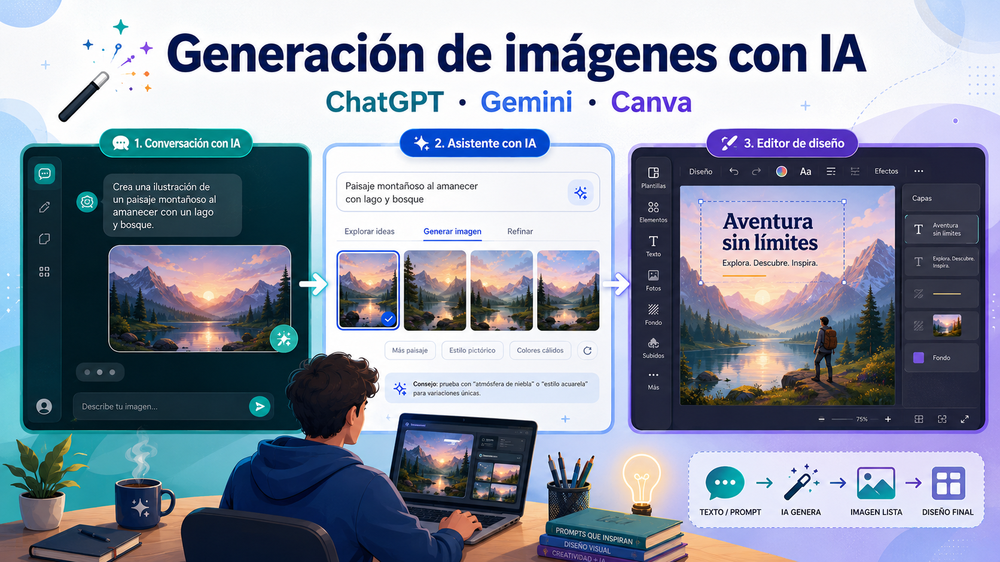
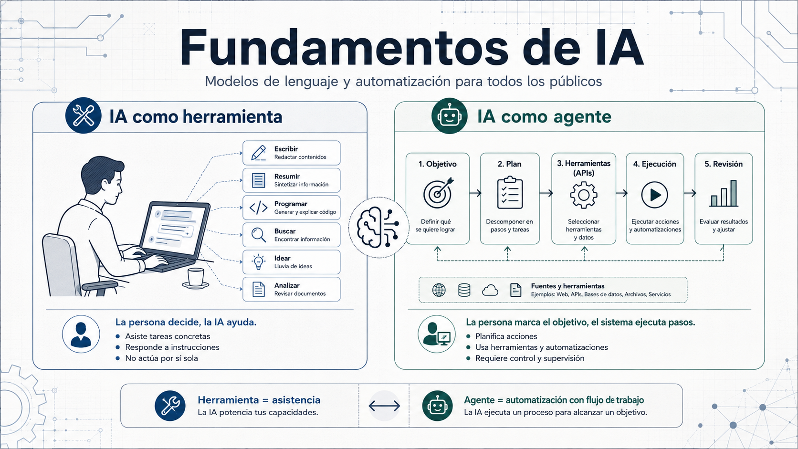
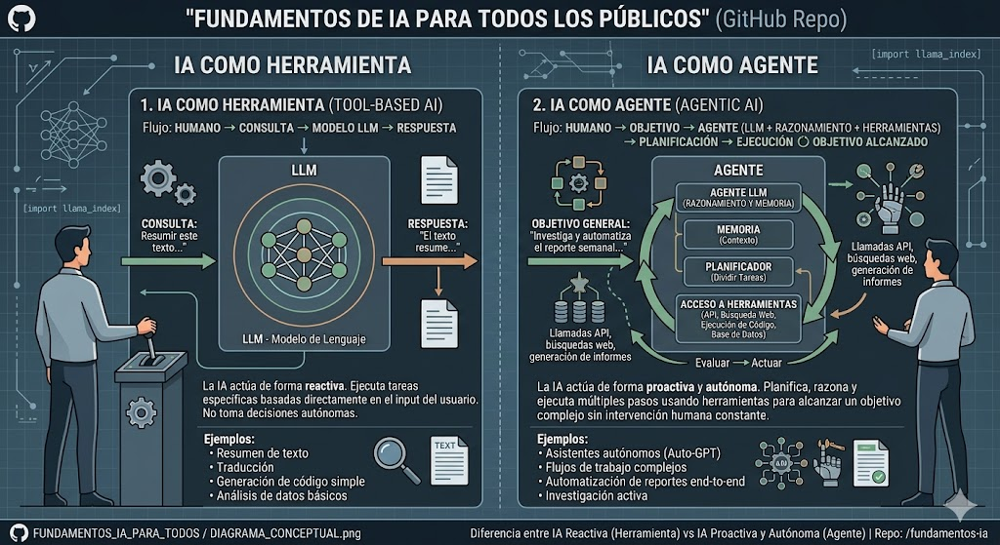

<p align="center">
  
</p>


# Generación de imágenes con IA: ChatGPT, Gemini y Canva

## Índice

1. [Explicación rápida](#1-explicación-rápida)
2. [Para qué sirve la generación de imágenes con IA](#2-para-qué-sirve-la-generación-de-imágenes-con-ia)
3. [Concepto clave: no es magia, es generación probabilística](#3-concepto-clave-no-es-magia-es-generación-probabilística)
4. [Qué es un prompt de imagen](#4-qué-es-un-prompt-de-imagen)
5. [ChatGPT para generar imágenes](#5-chatgpt-para-generar-imágenes)
6. [Qué puede hacer ChatGPT con imágenes](#6-qué-puede-hacer-chatgpt-con-imágenes)
7. [Qué no puede hacer bien ChatGPT con imágenes](#7-qué-no-puede-hacer-bien-chatgpt-con-imágenes)
8. [Cuándo usar ChatGPT para imágenes](#8-cuándo-usar-chatgpt-para-imágenes)
9. [Gemini para generar imágenes](#9-gemini-para-generar-imágenes)
10. [Qué puede hacer Gemini con imágenes](#10-qué-puede-hacer-gemini-con-imágenes)
11. [Qué no puede hacer bien Gemini con imágenes](#11-qué-no-puede-hacer-bien-gemini-con-imágenes)
12. [Cuándo usar Gemini para imágenes](#12-cuándo-usar-gemini-para-imágenes)
13. [Canva para generar imágenes con IA](#13-canva-para-generar-imágenes-con-ia)
14. [Qué puede hacer Canva con imágenes de IA](#14-qué-puede-hacer-canva-con-imágenes-de-ia)
15. [Qué no puede hacer bien Canva con IA](#15-qué-no-puede-hacer-bien-canva-con-ia)
16. [Cuándo usar Canva para imágenes](#16-cuándo-usar-canva-para-imágenes)
17. [Comparativa rápida](#17-comparativa-rápida)
18. [Diferencia entre generar imagen y diseñar](#18-diferencia-entre-generar-imagen-y-diseñar)
19. [Flujo recomendado para clase o pyme](#19-flujo-recomendado-para-clase-o-pyme)
20. [Prompt base para generar imágenes](#20-prompt-base-para-generar-imágenes)
21. [Ejemplo de prompt para ChatGPT](#21-ejemplo-de-prompt-para-chatgpt)
22. [Ejemplo de prompt para Gemini](#22-ejemplo-de-prompt-para-gemini)
23. [Ejemplo de prompt para Canva](#23-ejemplo-de-prompt-para-canva)
24. [Cómo mejorar resultados](#24-cómo-mejorar-resultados)
25. [Errores frecuentes](#25-errores-frecuentes)
26. [Conceptos técnicos mínimos](#26-conceptos-técnicos-mínimos)
27. [Riesgos y límites importantes](#27-riesgos-y-límites-importantes)
28. [Recomendación práctica por caso](#28-recomendación-práctica-por-caso)
29. [Producción mínima recomendada](#29-producción-mínima-recomendada)
30. [Diferencia entre prototipo y uso profesional](#30-diferencia-entre-prototipo-y-uso-profesional)
31. [Conclusión](#31-conclusión)
32. [Resumen final](#32-resumen-final)

---

## 1. Explicación rápida

Generar imágenes con IA significa pedirle a una herramienta que cree una imagen a partir de una descripción escrita.

Por ejemplo:

> “Crea una imagen de una pyme usando inteligencia artificial para mejorar su atención al cliente, con estilo moderno, profesional y colores azules.”

La herramienta interpreta la frase y genera una imagen nueva.

También se puede usar para editar imágenes existentes:

> “Cambia el fondo por una oficina moderna.”
> “Haz que esta imagen parezca una ilustración.”
> “Quita el objeto del centro.”
> “Añade un texto grande que diga: Curso de IA para PYMES.”

La idea básica es sencilla: escribimos lo que queremos ver y la IA intenta convertirlo en una imagen.

---

## 2. Para qué sirve la generación de imágenes con IA

La generación de imágenes con IA sirve para crear material visual rápido sin partir de cero.

Puede ayudar en tareas como:

* Crear imágenes para presentaciones.
* Diseñar portadas para documentos.
* Generar banners para redes sociales.
* Crear imágenes para un repositorio de GitHub.
* Preparar material educativo.
* Hacer bocetos visuales de ideas.
* Crear imágenes para campañas internas.
* Diseñar prototipos antes de pedir un diseño profesional.
* Adaptar imágenes a distintos estilos.
* Crear ejemplos visuales para explicar conceptos.

No sustituye siempre a un diseñador profesional, pero sí permite avanzar mucho más rápido en fases iniciales.

---

## 3. Concepto clave: no es magia, es generación probabilística

Una IA de imagen no “dibuja” como una persona.

Lo que hace es generar una imagen nueva a partir de patrones aprendidos durante su entrenamiento. Ha visto millones de ejemplos de imágenes y textos asociados, y aprende relaciones como:

* “perro” suele tener ciertas formas.
* “oficina moderna” suele tener mesas, pantallas, luz limpia.
* “estilo cómic” tiene líneas marcadas y colores planos.
* “fotografía profesional” implica iluminación, cámara, composición y realismo.

Cuando escribimos un prompt, la herramienta genera una imagen que estadísticamente encaja con esa descripción.

Por eso puede acertar mucho, pero también puede inventar, deformar, malinterpretar o crear detalles incorrectos.

---

## 4. Qué es un prompt de imagen

Un prompt de imagen es la instrucción que damos a la IA para que cree o modifique una imagen.

Un prompt básico sería:

```text
Crea una imagen de una persona trabajando con inteligencia artificial en una oficina.
```

Un prompt mejor sería:

```text
Crea una imagen horizontal para una presentación. Debe mostrar a una persona trabajando con inteligencia artificial en una pequeña empresa. Estilo profesional, moderno, limpio, con colores azules y blancos. La imagen debe transmitir productividad, tecnología accesible y transformación digital. Sin texto dentro de la imagen.
```

La diferencia está en el nivel de detalle.

Un buen prompt suele incluir:

* Tema principal.
* Contexto.
* Estilo visual.
* Formato.
* Colores.
* Nivel de realismo.
* Elementos que deben aparecer.
* Elementos que no deben aparecer.
* Uso final de la imagen.

---

## 5. ChatGPT para generar imágenes

ChatGPT puede generar imágenes desde una conversación. Esto es útil porque permite trabajar de forma iterativa.

No hace falta escribir un prompt perfecto desde el principio. Podemos hablar con la herramienta:

```text
Crea una imagen para explicar qué es la inteligencia artificial a personas sin conocimientos técnicos.
```

Después podemos pedir cambios:

```text
Hazla más sencilla.
```

```text
Quita los elementos demasiado futuristas.
```

```text
Hazla más profesional, como para una presentación de empresa.
```

```text
Adáptala a formato banner para LinkedIn.
```

La ventaja principal de ChatGPT es la conversación. Podemos construir la imagen poco a poco.

---

## 6. Qué puede hacer ChatGPT con imágenes

ChatGPT puede ayudar a:

* Crear imágenes desde cero.
* Editar imágenes cargadas por el usuario.
* Cambiar estilo visual.
* Generar portadas, banners e ilustraciones.
* Crear imágenes para explicar conceptos.
* Mantener una conversación sobre una imagen.
* Proponer prompts mejores.
* Adaptar una imagen a distintos públicos.
* Crear variaciones de una misma idea.
* Convertir una idea abstracta en una escena visual.

Ejemplo:

```text
Crea una imagen para repositorio de GitHub sobre fundamentos de IA para todos los públicos. Sobria, estilo ingeniería, sobre modelos de lenguaje y automatización. Que explique la diferencia entre una IA como herramienta y una IA como agente. 
```

<p align="center">
  
</p>

---

## 7. Qué no puede hacer bien ChatGPT con imágenes

ChatGPT no siempre es fiable para:

* Mantener todos los detalles exactos en varias versiones.
* Generar texto perfecto dentro de una imagen.
* Respetar medidas técnicas complejas como si fuera CAD.
* Crear planos técnicos válidos.
* Garantizar exactitud anatómica, mecánica o científica.
* Reproducir logos, marcas o estilos protegidos sin restricciones.
* Generar imágenes de personas reales sin limitaciones.
* Asegurar que una imagen sea legalmente utilizable en cualquier contexto.
* Sustituir una revisión humana de diseño, marca o derechos de uso.

También puede cometer errores como:

* Manos deformadas.
* Textos mal escritos.
* Objetos duplicados.
* Caras extrañas.
* Elementos que no se pidieron.
* Mala interpretación del contexto.
* Imágenes demasiado genéricas.

---

## 8. Cuándo usar ChatGPT para imágenes

ChatGPT es especialmente útil cuando queremos pensar visualmente.

Es buena opción para:

* Ideas iniciales.
* Banners conceptuales.
* Imágenes educativas.
* Portadas de módulos.
* Explicaciones visuales.
* Variaciones rápidas.
* Transformar una idea en una propuesta visual.
* Preparar imágenes para clase.

No es la mejor opción si necesitamos:

* Diseño final corporativo muy controlado.
* Composición precisa con muchas capas editables.
* Plantillas de marca complejas.
* Exportación directa a formatos de diseño profesional.
* Trabajo colaborativo de diseño con varias personas.

Para eso suele encajar mejor Canva.

---

## 9. Gemini para generar imágenes

Gemini es la herramienta de IA de Google. También permite generar y editar imágenes mediante texto.

Su enfoque es parecido al de ChatGPT: escribimos una instrucción y Gemini genera una imagen.

Ejemplo:

```text
Genera una imagen de una pequeña empresa usando herramientas de IA para organizar tareas, atender clientes y analizar datos.
```

También se puede usar para editar imágenes:

```text
Cambia el fondo por una sala de formación moderna.
```

```text
Haz que esta imagen tenga estilo infografía.
```

```text
Combina estas dos imágenes en una escena coherente.
```

La ventaja de Gemini está en su integración con el ecosistema de Google y en sus capacidades multimodales: texto, imagen, documentos y otros contenidos pueden trabajarse dentro del mismo entorno.

---

## 10. Qué puede hacer Gemini con imágenes

Gemini puede ayudar a:

* Generar imágenes desde texto.
* Editar imágenes cargadas.
* Hacer cambios locales en partes de una imagen.
* Crear variaciones.
* Combinar ideas visuales.
* Generar imágenes para documentos, clases o presentaciones.
* Crear diagramas o infografías sencillas.
* Trabajar con imágenes dentro del ecosistema Google.
* Exportar o continuar trabajo en herramientas relacionadas, según disponibilidad de cuenta y región.

Ejemplos útiles:

```text
Crea una imagen didáctica para explicar qué es un modelo de lenguaje a personas sin conocimientos técnicos.
```

```text
Genera una imagen tipo póster para una clase sobre IA aplicada a pymes.
```

```text
Edita esta imagen para que sea más limpia, con menos elementos y mejor iluminación.
```

```text
Crea una infografía sencilla sobre los pasos para usar IA en una empresa.
```

---

## 11. Qué no puede hacer bien Gemini con imágenes

Gemini también tiene límites.

No siempre es fiable para:

* Crear texto perfecto dentro de imágenes.
* Respetar instrucciones complejas con muchos detalles.
* Mantener consistencia total entre varias imágenes.
* Generar resultados idénticos de forma repetible.
* Producir diseños finales con control de marca avanzado.
* Sustituir una herramienta de maquetación.
* Garantizar precisión legal, técnica o científica.
* Trabajar igual en todas las regiones, cuentas o idiomas.

Además, algunas funciones pueden depender de:

* País.
* Idioma.
* Edad del usuario.
* Tipo de cuenta.
* Cuenta personal, educativa o de empresa.
* Plan gratuito o de pago.
* Disponibilidad temporal de la función.

Esto es importante en clase: puede ocurrir que a un alumno le aparezca una opción y a otro no.


Ejemplo:

```text
Crea una imagen para repositorio de GitHub sobre fundamentos de IA para todos los públicos. Sobria, estilo ingeniería, sobre modelos de lenguaje y automatización. Que explique la diferencia entre una IA como herramienta y una IA como agente. 
```

<p align="center">
  
</p>

---

## 12. Cuándo usar Gemini para imágenes

Gemini encaja bien cuando:

* Ya se trabaja con herramientas de Google.
* Se quiere crear una imagen rápida para un documento o presentación.
* Se quiere combinar texto, imágenes y documentos.
* Se quieren hacer pruebas visuales sencillas.
* Se trabaja en un entorno educativo o empresarial basado en Google Workspace.

No es ideal cuando:

* Se necesita diseño final muy maquetado.
* Se necesita control avanzado de capas.
* Se necesita una plantilla corporativa muy estable.
* Se necesita edición visual manual muy precisa.

En esos casos Canva suele ser más práctico.

---

## 13. Canva para generar imágenes con IA

Canva es diferente a ChatGPT y Gemini.

ChatGPT y Gemini son principalmente asistentes conversacionales. Canva es una herramienta de diseño.

Eso significa que Canva no solo genera imágenes, sino que permite colocarlas en una composición: una diapositiva, un cartel, un post de LinkedIn, un flyer, una portada, una infografía o una presentación.

Canva puede generar imágenes con IA, pero su gran ventaja es que después podemos editar el diseño de forma visual.

Ejemplo:

```text
Genera una imagen de fondo para una presentación sobre inteligencia artificial aplicada a pymes.
```

Después podemos:

* Añadir texto.
* Cambiar tipografía.
* Ajustar colores.
* Mover elementos.
* Usar plantillas.
* Exportar en PDF, PNG, JPG o presentación.
* Aplicar identidad visual.
* Trabajar con otros usuarios.

---

## 14. Qué puede hacer Canva con imágenes de IA

Canva puede ayudar a:

* Generar imágenes desde texto.
* Crear diseños completos.
* Usar plantillas.
* Editar imágenes.
* Cambiar fondos.
* Borrar elementos.
* Añadir elementos gráficos.
* Crear publicaciones para redes sociales.
* Crear presentaciones.
* Diseñar infografías.
* Adaptar una imagen a una marca.
* Exportar piezas listas para usar.
* Trabajar de forma colaborativa.

Ejemplos útiles:

```text
Crea un banner para LinkedIn sobre un curso de IA aplicada a pymes.
```

```text
Diseña una portada para una presentación del módulo Fundamentos de IA.
```

```text
Crea una infografía sobre los pasos para usar ChatGPT en una empresa.
```

```text
Genera una imagen de fondo sobria, tecnológica y profesional, sin texto.
```

---

## 15. Qué no puede hacer bien Canva con IA

Canva no siempre es la mejor herramienta para razonar sobre una imagen desde cero.

Puede quedarse corto si queremos:

* Una conversación larga y técnica sobre el significado de la imagen.
* Un análisis profundo del concepto antes de generarla.
* Comparar varios enfoques pedagógicos.
* Crear prompts muy elaborados desde una explicación larga.
* Trabajar con lógica compleja o criterios técnicos avanzados.

También tiene límites comunes a las herramientas de imagen con IA:

* Puede generar detalles incorrectos.
* Puede crear texto defectuoso en imágenes.
* Puede producir resultados genéricos.
* Puede no entender bien conceptos abstractos.
* Puede depender de funciones de pago.
* Puede tener restricciones por derechos, marca o contenido.

Canva es fuerte en diseño práctico, no necesariamente en razonamiento profundo.

---

## 16. Cuándo usar Canva para imágenes

Canva es la mejor opción cuando el objetivo final es una pieza visual terminada.

Es ideal para:

* Presentaciones.
* Portadas.
* Banners.
* Carteles.
* Posts de LinkedIn.
* Infografías.
* Material didáctico.
* Documentos visuales.
* Diseños con plantilla.
* Trabajo colaborativo.

No es la primera opción si todavía estamos pensando la idea.

Una buena estrategia es:

1. Pensar la idea con ChatGPT o Gemini.
2. Generar varias propuestas visuales.
3. Llevar la mejor idea a Canva.
4. Maquetar el resultado final.
5. Revisar manualmente antes de publicar.

---

## 17. Comparativa rápida

| Herramienta | Mejor para                                             | Punto fuerte                                     | Límite principal                                  |
| ----------- | ------------------------------------------------------ | ------------------------------------------------ | ------------------------------------------------- |
| ChatGPT     | Idear, generar y editar imágenes conversando           | Iteración mediante lenguaje natural              | No es una herramienta completa de diseño          |
| Gemini      | Generar y editar imágenes dentro del ecosistema Google | Integración con Google y trabajo multimodal      | Disponibilidad variable según cuenta, país o plan |
| Canva       | Crear piezas visuales finales                          | Diseño, plantillas, edición visual y exportación | Menos fuerte como asistente conceptual profundo   |

---

## 18. Diferencia entre generar imagen y diseñar

Generar una imagen no es lo mismo que diseñar.

Generar imagen:

```text
Crea una imagen de una oficina moderna con IA.
```

Diseñar:

```text
Crea una portada para una presentación con título, subtítulo, jerarquía visual, colores corporativos, espacio para logo, formato 16:9 y estilo profesional.
```

La generación crea contenido visual.

El diseño organiza ese contenido para comunicar algo.

Por eso Canva es tan útil: permite pasar de imagen generada a pieza comunicativa.

---

## 19. Flujo recomendado para clase o pyme

Un flujo práctico sería:

```text
Idea → Prompt → Imagen generada → Revisión → Edición → Diseño final → Publicación
```

Ejemplo aplicado:

1. Queremos una imagen para explicar IA generativa.
2. Pedimos a ChatGPT que proponga 5 ideas visuales.
3. Elegimos una.
4. Generamos la imagen en ChatGPT, Gemini o Canva.
5. Revisamos errores.
6. Editamos o regeneramos.
7. Montamos el diseño final en Canva.
8. Exportamos.
9. Publicamos o usamos en clase.

---

## 20. Prompt base para generar imágenes

Puedes usar esta plantilla:

```text
Crea una imagen [formato] sobre [tema principal].

Contexto:
[explica para qué se usará la imagen]

Público objetivo:
[personas a las que va dirigida]

Estilo visual:
[realista, ilustración, infografía, minimalista, corporativo, educativo, etc.]

Elementos que deben aparecer:
- [elemento 1]
- [elemento 2]
- [elemento 3]

Elementos que NO deben aparecer:
- [elemento no deseado]
- [elemento no deseado]

Colores:
[indicar colores principales]

Formato:
[horizontal 16:9, cuadrado, vertical, banner, portada, etc.]

Importante:
No incluyas texto dentro de la imagen salvo que lo pida explícitamente.
```

---

## 21. Ejemplo de prompt para ChatGPT

```text
Crea una imagen horizontal 16:9 para una presentación.

Tema:
La inteligencia artificial como herramienta de apoyo para pequeñas empresas.

Público:
Personas sin conocimientos técnicos.

Estilo:
Profesional, claro, moderno, sobrio, con estética de ingeniería.

Elementos:
- Una pequeña empresa u oficina.
- Personas trabajando con ordenadores.
- Elementos visuales que representen IA, datos y automatización.
- Ambiente cercano, no futurista exagerado.

Colores:
Azules, blancos y grises.

Evitar:
- Robots humanoides.
- Estilo ciencia ficción.
- Texto dentro de la imagen.
- Logos de marcas reales.
```

---

## 22. Ejemplo de prompt para Gemini

```text
Genera una imagen didáctica para explicar la generación de imágenes con IA.

Debe mostrar a una persona escribiendo una descripción y una herramienta de IA convirtiendo esa descripción en una imagen.

Estilo:
Ilustración limpia, moderna, educativa.

Formato:
Horizontal, apta para una diapositiva.

Público:
Alumnos de un curso de IA aplicada sin formación técnica.

Evita:
Texto dentro de la imagen, estética infantil y exceso de elementos.
```

---

## 23. Ejemplo de prompt para Canva

```text
Crea un banner horizontal para LinkedIn sobre un curso de inteligencia artificial aplicada a pymes.

Estilo:
Profesional, tecnológico, sobrio y moderno.

Elementos:
- Fondo abstracto relacionado con IA.
- Espacio limpio para colocar un título.
- Sensación de aprendizaje, productividad y transformación digital.

Colores:
Azul oscuro, blanco y gris.

No incluir:
Texto generado automáticamente, logos ficticios ni personas con rostros deformados.
```

---

## 24. Cómo mejorar resultados

Si la imagen sale mal, no conviene rendirse en el primer intento.

Mejor hacer iteraciones:

```text
Hazla menos futurista.
```

```text
Hazla más profesional.
```

```text
Simplifica la escena.
```

```text
Elimina elementos decorativos innecesarios.
```

```text
Dale más espacio vacío para poner texto encima.
```

```text
Hazla más realista.
```

```text
Hazla más estilo infografía.
```

```text
No incluyas letras ni palabras dentro de la imagen.
```

Una regla práctica:

> Cuanto más claro sea el uso final de la imagen, mejor será el resultado.

---

## 25. Errores frecuentes

### Error 1: pedir algo demasiado genérico

Mal:

```text
Haz una imagen sobre IA.
```

Mejor:

```text
Crea una imagen horizontal para una presentación sobre IA aplicada a pequeñas empresas, con estilo profesional, sin robots y sin texto.
```

---

### Error 2: pedir demasiado en una sola imagen

Mal:

```text
Haz una imagen que explique toda la historia de la IA, los tipos de modelos, los riesgos, las oportunidades, la automatización, los agentes y el futuro del trabajo.
```

Mejor:

```text
Crea una imagen sencilla que represente la IA como una herramienta de apoyo al trabajo humano en una empresa.
```

---

### Error 3: confiar en el texto dentro de la imagen

Las herramientas de imagen han mejorado mucho, pero el texto dentro de imágenes todavía puede fallar.

Para material profesional suele ser mejor:

1. Generar la imagen sin texto.
2. Añadir el texto después en Canva, PowerPoint o Google Slides.

---

### Error 4: no revisar detalles

Antes de publicar una imagen generada con IA, revisar:

* Manos.
* Caras.
* Letras.
* Logos.
* Objetos extraños.
* Elementos duplicados.
* Coherencia del mensaje.
* Posibles problemas de derechos.
* Adecuación al público.

---

## 26. Conceptos técnicos mínimos

### Modelo generativo

Es un sistema de IA capaz de crear contenido nuevo.

Puede generar:

* Texto.
* Imágenes.
* Audio.
* Vídeo.
* Código.

En este caso hablamos de modelos que generan imágenes.

---

### Prompt

Es la instrucción que damos a la IA.

En imagen, el prompt describe qué queremos ver.

---

### Multimodalidad

Una herramienta multimodal puede trabajar con varios tipos de información.

Por ejemplo:

* Texto.
* Imagen.
* Audio.
* Vídeo.
* Documentos.

ChatGPT y Gemini son herramientas multimodales porque pueden trabajar con texto e imágenes, y según el plan o función disponible, también con otros tipos de contenido.

---

### Edición local

Significa modificar solo una parte de una imagen.

Ejemplo:

```text
Cambia solo el fondo y mantén igual a la persona.
```

Esto es más difícil que generar una imagen desde cero, porque la IA debe cambiar una zona sin romper el resto.

---

### Consistencia

La consistencia es la capacidad de mantener el mismo personaje, estilo o diseño en varias imágenes.

Ejemplo:

```text
Crea cinco imágenes con el mismo personaje explicando distintos conceptos de IA.
```

Este punto sigue siendo difícil. Algunas herramientas lo hacen mejor que otras, pero no siempre sale perfecto.

---

### Resolución

La resolución indica el tamaño y nivel de detalle de la imagen.

Una imagen puede valer para una diapositiva, pero no necesariamente para impresión profesional.

Antes de imprimir, revisar tamaño, nitidez y formato.

---

## 27. Riesgos y límites importantes

### Derechos de autor

No todo lo que genera una IA debe usarse automáticamente en público.

Hay que tener cuidado con:

* Marcas registradas.
* Logos.
* Personajes conocidos.
* Estilos de artistas vivos.
* Fotografías de personas reales.
* Imágenes subidas por terceros.
* Material protegido.

---

### Privacidad

No conviene subir imágenes sensibles sin pensar.

Ejemplos:

* Menores.
* Documentos privados.
* Matrículas.
* Direcciones.
* Credenciales.
* Información médica.
* Imágenes internas de empresa.
* Capturas con datos personales.

---

### Sesgos

La IA puede reproducir estereotipos.

Por ejemplo:

* Representar siempre ciertos trabajos con un mismo perfil de persona.
* Asociar tecnología solo a hombres jóvenes.
* Mostrar empresas de forma poco diversa.
* Repetir clichés visuales.

Hay que revisar el resultado con criterio.

---

### Falsa precisión

Una imagen puede parecer profesional aunque sea incorrecta.

Esto es peligroso en:

* Medicina.
* Ingeniería.
* Arquitectura.
* Seguridad.
* Educación técnica.
* Ciencia.
* Legal.
* Finanzas.

Una imagen bonita no garantiza que el contenido sea correcto.

---

## 28. Recomendación práctica por caso

### Para pensar ideas visuales

Usar ChatGPT o Gemini.

```text
Dame 10 ideas visuales para explicar qué es la IA generativa a alumnos sin conocimientos técnicos.
```

---

### Para generar una imagen rápida

Usar ChatGPT, Gemini o Canva.

Depende de cuál esté disponible y resulte más cómodo.

---

### Para editar una imagen mediante conversación

Usar ChatGPT o Gemini.

```text
Edita esta imagen para que sea más clara, más sobria y más profesional.
```

---

### Para crear una pieza final

Usar Canva.

Especialmente si hace falta:

* Texto.
* Logo.
* Plantilla.
* Formato específico.
* Exportación.
* Diseño para redes.
* Presentación.
* Infografía.

---

### Para clase

Flujo recomendado:

```text
ChatGPT/Gemini para pensar → generación de imagen → Canva para terminar diseño
```

---

## 29. Producción mínima recomendada

Para un uso serio en formación o empresa, no basta con generar la imagen.

Conviene guardar:

* Prompt usado.
* Herramienta utilizada.
* Fecha.
* Versión final.
* Uso previsto.
* Revisión humana realizada.
* Fuente de imágenes subidas, si las hay.
* Decisión sobre publicación.

Esto ayuda a trabajar con trazabilidad.

No hace falta montar un sistema complejo. Puede bastar con una tabla sencilla:

| Fecha      | Herramienta | Prompt                     | Uso          | Revisado | Publicado |
| ---------- | ----------- | -------------------------- | ------------ | -------- | --------- |
| 2026-05-28 | ChatGPT     | Imagen sobre IA para pymes | Presentación | Sí       | Sí        |

---

## 30. Diferencia entre prototipo y uso profesional

### Prototipo

Uso rápido para explorar ideas.

Ejemplo:

* Probar portadas.
* Crear imágenes de ejemplo.
* Preparar material interno.
* Bocetar una campaña.

Aquí importa la velocidad.

---

### Uso profesional

Uso público o corporativo.

Ejemplo:

* Web oficial.
* LinkedIn de empresa.
* Material comercial.
* Curso vendido a clientes.
* Campaña de marketing.
* Documentación formal.

Aquí importa la revisión.

Antes de publicar hay que comprobar:

* Calidad visual.
* Derechos.
* Coherencia con la marca.
* Ausencia de errores.
* Mensaje correcto.
* Adecuación al público.

---

## 31. Conclusión

La generación de imágenes con IA permite crear material visual de forma muy rápida.

ChatGPT destaca por la conversación y la iteración.

Gemini destaca por su integración con Google y sus capacidades multimodales.

Canva destaca por convertir imágenes en diseños finales listos para presentar, publicar o compartir.

La mejor estrategia no es elegir una sola herramienta para todo.

La estrategia más práctica es combinarlas:

```text
Pensar con ChatGPT o Gemini.
Generar varias opciones.
Elegir la mejor.
Maquetar y terminar en Canva.
Revisar antes de publicar.
```

La IA acelera mucho el trabajo visual, pero no elimina la necesidad de criterio humano.

Una imagen generada puede ser útil, bonita y rápida, pero siempre debe revisarse antes de usarla en un contexto profesional.

---

## 32. Resumen final

* Generar imágenes con IA consiste en describir una imagen y dejar que el modelo la cree.
* ChatGPT es muy útil para iterar conversando.
* Gemini es útil dentro del ecosistema Google y para trabajo multimodal.
* Canva es ideal para diseño final, presentaciones e infografías.
* Las imágenes generadas pueden contener errores.
* El texto dentro de imágenes debe revisarse especialmente.
* No se deben subir datos sensibles sin criterio.
* Para publicar, siempre debe haber revisión humana.
* La mejor práctica es usar IA para acelerar, no para apagar el juicio crítico.
