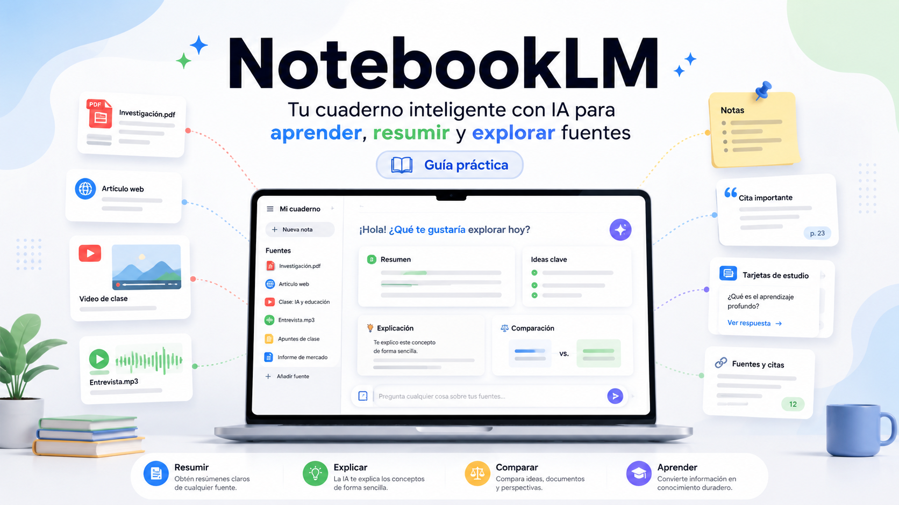

<p align="center">
  
</p>


# Qué es NotebookLM de Google

## 1. Explicación rápida

NotebookLM es una herramienta de Google que funciona como un **cuaderno inteligente con IA**.

Dicho de forma sencilla: tú le das documentos, apuntes, PDFs, enlaces, vídeos o textos, y NotebookLM te ayuda a entenderlos, resumirlos, ordenarlos y transformarlos en otros formatos.

No es exactamente “un ChatGPT de Google”. Se parece en que puedes hacerle preguntas, pero su idea principal no es responder de memoria sobre cualquier tema, sino trabajar sobre el material que tú le das.

Una forma fácil de entenderlo:

> ChatGPT o Gemini suelen funcionar como un asistente general.
> NotebookLM funciona más como un asistente de estudio, lectura, investigación y análisis documental.

Es decir, NotebookLM no parte de cero. Parte de tus fuentes.

---

## 2. Ejemplo sencillo

Imagina que tienes:

* Un temario en PDF.
* Un manual técnico.
* Una presentación.
* Una normativa.
* Un vídeo de YouTube.
* Un documento de Google Docs.
* Apuntes de clase.
* Un informe de empresa.

En vez de leerlo todo manualmente desde el principio, puedes subir ese material a NotebookLM y pedirle cosas como:

* “Explícame este documento como si no supiera nada.”
* “Hazme un resumen por apartados.”
* “Saca los conceptos clave.”
* “Crea preguntas tipo test.”
* “Hazme una guía de estudio.”
* “Compárame estos dos documentos.”
* “¿Dónde se habla de este tema?”
* “Convierte esto en una explicación para alumnos.”
* “Prepárame un guion para una clase.”
* “Hazme un audio resumen.”
* “Genera una presentación o estructura visual.”

La clave es que NotebookLM intenta responder apoyándose en las fuentes que has añadido al cuaderno.

---

## 3. Qué problema resuelve

NotebookLM resuelve un problema muy común: tenemos demasiada información y poco tiempo para procesarla.

Antes, cuando una persona recibía un documento largo, tenía que:

1. Leerlo completo.
2. Subrayar.
3. Sacar ideas principales.
4. Hacer esquemas.
5. Preparar preguntas.
6. Buscar contradicciones.
7. Convertirlo en clase, informe, presentación o resumen.

NotebookLM acelera parte de ese trabajo.

No sustituye la lectura crítica, pero sí puede hacer una primera pasada muy útil.

---

## 4. Qué puede hacer NotebookLM

### 4.1. Resumir documentos

Puede leer el contenido que le aportas y generar resúmenes.

Ejemplos:

```text
Resume este PDF en 10 puntos.
Haz un resumen para alguien sin conocimientos técnicos.
Dime qué partes son más importantes para un examen.
Extrae las ideas principales del capítulo 2.
```

Esto es útil para estudiar, preparar clases, analizar documentación o revisar informes.

---

### 4.2. Responder preguntas sobre tus fuentes

Puedes preguntarle cosas sobre el material cargado.

Ejemplos:

```text
¿Qué dice el documento sobre protección de datos?
¿Qué requisitos aparecen para acceder al programa?
¿Qué diferencias hay entre el módulo 1 y el módulo 2?
¿Dónde se menciona la evaluación final?
```

La ventaja frente a un chatbot general es que NotebookLM puede apoyarse en tus documentos concretos.

---

### 4.3. Citar partes del documento

NotebookLM puede mostrar referencias o citas internas hacia las fuentes usadas.

Esto es importante porque permite comprobar de dónde sale una respuesta.

Para formación, investigación o trabajo profesional, esto es una mejora importante frente a respuestas sin trazabilidad.

Regla práctica:

> Si una respuesta no se puede comprobar en la fuente, no debe darse por buena automáticamente.

---

### 4.4. Crear guías de estudio

Puede transformar documentos en materiales de aprendizaje.

Por ejemplo:

```text
Crea una guía de estudio de este tema.
Hazme una lista de conceptos clave.
Genera preguntas de repaso.
Crea tarjetas de memoria.
Haz un cuestionario tipo test.
```

Esto lo hace útil para estudiantes, docentes y equipos de formación.

---

### 4.5. Generar audios explicativos

Una de sus funciones más conocidas es crear resúmenes en formato audio, como si fueran conversaciones o explicaciones narradas.

Esto puede servir para:

* Repasar mientras caminas.
* Escuchar un resumen antes de una clase.
* Convertir un documento largo en una explicación más ligera.
* Facilitar el aprendizaje a personas que prefieren escuchar.

Pero hay que tener cuidado: un audio generado por IA no sustituye a la fuente original. Puede simplificar, omitir matices o sonar más seguro de lo que realmente debería.

---

### 4.6. Generar vídeos o explicaciones visuales

NotebookLM también puede convertir materiales en explicaciones visuales o vídeos resumidos, según disponibilidad de la función y tipo de cuenta.

Esto puede ayudar a transformar documentación densa en contenido más fácil de consumir.

Ejemplo de uso:

```text
Crea una explicación visual de este informe.
Convierte este material en una presentación introductoria.
Genera un resumen visual para explicar a alumnos.
```

---

### 4.7. Comparar documentos

Puede trabajar con varias fuentes dentro de un mismo cuaderno.

Esto permite hacer preguntas como:

```text
¿Qué diferencias hay entre estos dos documentos?
¿Qué temas se repiten en todas las fuentes?
¿Qué contradicciones hay entre el PDF y la presentación?
¿Qué partes del temario aparecen también en el vídeo?
```

Esto es especialmente útil en:

* Revisión de normativas.
* Preparación de cursos.
* Análisis de documentación técnica.
* Comparación de propuestas.
* Investigación académica.
* Análisis de requisitos.

---

### 4.8. Ayudar a preparar clases

Para docentes, NotebookLM puede ser muy práctico.

Puede ayudar a convertir un temario en:

* Esquema de clase.
* Actividades.
* Preguntas de debate.
* Explicaciones por niveles.
* Glosario.
* Casos prácticos.
* Evaluaciones.
* Resúmenes para alumnos.

Ejemplo:

```text
Tengo una clase de 4 horas sobre este documento.
Organízame una sesión con bloques de 45 minutos,
incluyendo explicación, práctica y repaso.
```

---

### 4.9. Ayudar en investigación

NotebookLM puede servir como apoyo para revisar fuentes y organizar información.

Puede ayudar a:

* Agrupar ideas.
* Detectar temas recurrentes.
* Preparar preguntas de investigación.
* Resumir bibliografía.
* Generar mapas conceptuales.
* Localizar conceptos dentro de fuentes largas.

Pero no debe usarse como sustituto de una revisión académica rigurosa.

---

## 5. Qué no puede hacer NotebookLM

### 5.1. No garantiza que todo sea correcto

Aunque trabaje con documentos, sigue siendo una herramienta de IA generativa.

Puede:

* Malinterpretar una fuente.
* Omitir información importante.
* Simplificar demasiado.
* Mezclar conceptos.
* Responder con exceso de seguridad.
* Dar una explicación incompleta.

Por eso siempre conviene revisar las respuestas importantes contra la fuente original.

---

### 5.2. No sustituye al experto

NotebookLM puede ayudar a entender documentos, pero no convierte automáticamente a una persona en especialista.

Por ejemplo:

* Puede resumir una ley, pero no sustituye a un abogado.
* Puede explicar un informe médico, pero no sustituye a un médico.
* Puede resumir un pliego técnico, pero no sustituye a un ingeniero responsable.
* Puede analizar un temario, pero no sustituye al criterio docente.

Es una herramienta de apoyo, no una autoridad final.

---

### 5.3. No entiende como una persona

NotebookLM no “comprende” como un humano.

Lo que hace es procesar lenguaje, detectar patrones, relacionar fragmentos y generar respuestas plausibles a partir del contenido disponible.

Puede parecer que razona, pero no tiene experiencia real, intención, responsabilidad profesional ni comprensión humana del contexto.

---

### 5.4. No arregla documentos mal hechos

Si subes documentos confusos, contradictorios o desactualizados, NotebookLM puede ayudarte a detectarlo, pero no puede garantizar que el resultado sea fiable.

Regla básica:

> Mala fuente de entrada, mala respuesta de salida.

En inglés se suele resumir como:

```text
Garbage in, garbage out.
```

Es decir, si los documentos son malos, incompletos o erróneos, la IA trabajará sobre una base débil.

---

### 5.5. No debe usarse a ciegas con información sensible

Hay que tener cuidado con documentos privados, datos personales, información confidencial, contratos, datos médicos, información de empresa o documentación interna.

Antes de subir algo, conviene preguntarse:

* ¿Tengo permiso para usar este documento?
* ¿Contiene datos personales?
* ¿Contiene información confidencial?
* ¿Puede afectar a clientes, alumnos, pacientes o empleados?
* ¿La política de mi empresa permite usar herramientas externas de IA?

En entornos profesionales, la seguridad y la privacidad son tan importantes como la productividad.

---

### 5.6. No es un sistema de gestión documental completo

NotebookLM ayuda a consultar y transformar fuentes, pero no sustituye por completo a:

* Un gestor documental.
* Un repositorio versionado.
* Un sistema de permisos empresarial.
* Una base de conocimiento corporativa bien gobernada.
* Un sistema de auditoría.
* Un buscador interno controlado.
* Un pipeline profesional de RAG.

Para uso personal, educativo o de análisis inicial es muy útil. Para producción empresarial, hace falta más control.

---

## 6. Diferencia entre NotebookLM, Gemini y ChatGPT

### 6.1. Gemini

Gemini es la familia de modelos y aplicaciones de IA de Google.

Puede responder preguntas generales, generar texto, analizar imágenes, ayudar con código, resumir, razonar y trabajar con diferentes tipos de contenido.

Gemini es más generalista.

---

### 6.2. ChatGPT

ChatGPT es una aplicación conversacional de OpenAI.

Puede ayudarte a escribir, programar, analizar, estudiar, generar ideas, preparar contenido, revisar documentos y trabajar con herramientas.

ChatGPT también es generalista.

---

### 6.3. NotebookLM

NotebookLM está más orientado a trabajar con fuentes concretas.

No es tanto “pregúntame cualquier cosa”, sino:

```text
Aquí tienes mis documentos.
Ayúdame a entenderlos, resumirlos, compararlos y transformarlos.
```

Resumen rápido:

| Herramienta        | Uso principal                              |
| ------------------ | ------------------------------------------ |
| ChatGPT            | Asistente general de IA                    |
| Gemini             | Asistente general de IA de Google          |
| NotebookLM         | Cuaderno inteligente basado en tus fuentes |
| Google Drive       | Almacenamiento de archivos                 |
| Google Docs        | Edición de documentos                      |
| Buscador de Google | Buscar información en la web               |

---

## 7. Concepto técnico mínimo: qué significa “basado en fuentes”

NotebookLM trabaja con una lógica parecida a lo que en IA se llama **RAG**.

RAG significa:

```text
Retrieval-Augmented Generation
```

En español:

```text
Generación aumentada por recuperación de información
```

Dicho fácil:

1. Tú subes documentos.
2. La herramienta los procesa.
3. Cuando haces una pregunta, busca fragmentos relevantes.
4. Usa esos fragmentos como contexto.
5. Genera una respuesta basada en esa información.

No es exactamente lo mismo que “entrenar un modelo”.

Esto es importante.

---

## 8. NotebookLM no entrena un modelo desde cero

Cuando subes documentos a NotebookLM, normalmente no estás entrenando una IA nueva.

Lo que haces es darle contexto para que pueda responder sobre ese material.

Diferencia sencilla:

| Concepto                 | Qué significa                                                   |
| ------------------------ | --------------------------------------------------------------- |
| Subir documentos         | Darle material de consulta                                      |
| RAG                      | Buscar fragmentos relevantes y responder con ellos              |
| Fine-tuning              | Ajustar un modelo con ejemplos para modificar su comportamiento |
| Entrenamiento desde cero | Crear un modelo desde la base con enormes cantidades de datos   |

NotebookLM se parece mucho más a un sistema de consulta inteligente sobre fuentes que a un entrenamiento real de modelo.

---

## 9. Ejemplo práctico para entenderlo

Supongamos que subes un PDF sobre prevención de riesgos laborales.

Si preguntas:

```text
¿Qué EPIs son obligatorios según este documento?
```

NotebookLM buscará en el documento fragmentos relacionados con EPIs y generará una respuesta.

Pero si el PDF no dice nada sobre un tipo concreto de casco, NotebookLM no debería inventarlo.

La respuesta correcta sería algo como:

```text
No encuentro información suficiente en las fuentes proporcionadas.
```

Esa es la conducta deseable: responder con evidencia o reconocer que no hay evidencia.

---

## 10. Buenas prácticas para usar NotebookLM

### 10.1. Usa fuentes limpias y relevantes

No subas veinte documentos sin orden si solo necesitas analizar uno.

Mejor:

* Un cuaderno por tema.
* Fuentes bien nombradas.
* Documentos actualizados.
* PDFs legibles.
* Versiones finales, no borradores mezclados.
* Separar temas distintos en cuadernos distintos.

---

### 10.2. Pregunta de forma concreta

Mala pregunta:

```text
Explícame esto.
```

Mejor pregunta:

```text
Explícame el apartado 3 del documento en lenguaje sencillo,
con ejemplos y separando conceptos clave.
```

Mala pregunta:

```text
Hazme un resumen.
```

Mejor pregunta:

```text
Hazme un resumen ejecutivo de 10 puntos,
indicando riesgos, obligaciones y dudas pendientes.
```

---

### 10.3. Pide nivel de dificultad

Puedes pedirle que adapte el lenguaje:

```text
Explícalo para alguien sin conocimientos técnicos.
Explícalo para un alumno de FP.
Explícalo para un directivo.
Explícalo para un ingeniero.
Explícalo con más detalle técnico.
```

Esto es muy útil cuando el público es heterogéneo.

---

### 10.4. Pide estructura

NotebookLM funciona mejor cuando le das una estructura clara.

Ejemplo:

```text
Analiza este documento con esta estructura:

1. Resumen general.
2. Conceptos clave.
3. Riesgos.
4. Obligaciones.
5. Partes confusas.
6. Preguntas que debería hacer al profesor.
7. Glosario final.
```

---

### 10.5. Verifica siempre las respuestas importantes

Para trabajo serio, no basta con copiar la respuesta.

Hay que revisar:

* Qué fuente ha usado.
* Si la cita corresponde realmente.
* Si falta contexto.
* Si hay contradicciones.
* Si ha simplificado demasiado.
* Si la respuesta tiene consecuencias legales, económicas, académicas o técnicas.

---

## 11. Casos de uso en educación

NotebookLM puede ayudar a:

* Preparar clases.
* Convertir temarios en guías.
* Crear preguntas tipo test.
* Preparar actividades.
* Crear glosarios.
* Explicar textos difíciles.
* Adaptar contenido a varios niveles.
* Generar resúmenes para alumnos.
* Preparar repasos antes de exámenes.
* Crear audios de estudio.

Ejemplo para un profesor:

```text
A partir de estas fuentes, crea una clase de 4 horas
para alumnos sin conocimientos previos.
Divide la sesión en bloques,
incluye ejemplos prácticos,
preguntas de repaso y una actividad final.
```

---

## 12. Casos de uso en empresa

NotebookLM puede ayudar a:

* Revisar informes.
* Resumir reuniones o documentos.
* Analizar manuales.
* Comparar propuestas.
* Extraer requisitos.
* Preparar documentación interna.
* Crear materiales de onboarding.
* Convertir documentación técnica en explicaciones sencillas.
* Analizar contratos o pliegos, siempre con revisión humana.

Ejemplo:

```text
Analiza este documento como si fueras un responsable de proyecto.
Extrae alcance, riesgos, obligaciones, fechas clave y puntos ambiguos.
```

---

## 13. Casos de uso para estudiantes

Puede ayudar a:

* Entender apuntes.
* Resumir PDFs.
* Crear esquemas.
* Preparar exámenes.
* Hacer tarjetas de memoria.
* Formular preguntas.
* Detectar conceptos que no se entienden.
* Convertir un tema largo en una explicación paso a paso.

Ejemplo:

```text
Explícame este tema como si fuera la primera vez que lo estudio.
Después hazme 10 preguntas para comprobar si lo he entendido.
```

---

## 14. Casos de uso para perfiles técnicos

Para usuarios más avanzados, NotebookLM puede servir como herramienta de análisis documental previo.

Por ejemplo:

* Revisar documentación de APIs.
* Analizar requisitos de software.
* Comparar especificaciones.
* Crear documentación funcional.
* Extraer riesgos de un pliego.
* Preparar FAQs a partir de manuales.
* Convertir documentación técnica en onboarding.

Pero para sistemas productivos, trazabilidad fuerte, evaluación automática, logs, permisos granulares y control de datos, NotebookLM puede quedarse corto.

En un entorno técnico maduro, se puede considerar una herramienta de productividad individual o de análisis inicial, no necesariamente el backend documental definitivo de una empresa.

---

## 15. Diferencia entre prototipo y producción

NotebookLM puede ser excelente para prototipar una base de conocimiento.

Por ejemplo:

```text
Subo documentos.
Pruebo preguntas.
Veo qué tipo de respuestas necesito.
Detecto qué documentos están mal.
Identifico dudas frecuentes.
Creo una primera guía.
```

Eso es prototipo.

Pero producción es otra cosa.

Un sistema en producción necesita:

* Control de usuarios.
* Permisos.
* Auditoría.
* Logs.
* Versionado documental.
* Evaluación de respuestas.
* Métricas.
* Control de costes.
* Seguridad.
* Integración con sistemas internos.
* Monitorización.
* Política clara de datos.
* Respuesta ante errores.

NotebookLM puede ayudar a explorar, pero no siempre sustituye una arquitectura propia de RAG o un sistema interno gobernado.

---

## 16. Riesgos principales

### 16.1. Riesgo de confianza excesiva

Como la respuesta suena bien, el usuario puede creer que es correcta.

Pero una respuesta bien redactada no significa que sea cierta.

---

### 16.2. Riesgo de fuente incompleta

Si falta un documento importante, NotebookLM puede responder con una visión parcial.

---

### 16.3. Riesgo de privacidad

Subir documentos sensibles a una herramienta externa puede ser inadecuado en ciertos contextos.

---

### 16.4. Riesgo de simplificación

Puede convertir temas complejos en explicaciones demasiado simples.

Esto ayuda al principio, pero puede ocultar matices importantes.

---

### 16.5. Riesgo de dependencia

Si una persona deja de leer críticamente y solo consume resúmenes, pierde criterio.

NotebookLM debe ser apoyo, no piloto automático.

---

## 17. Prompt básico para empezar

```text
Actúa como un profesor paciente y claro.

Voy a subir varias fuentes sobre un tema.
Tu tarea es ayudarme a entenderlas sin inventar información.

Primero:
1. Resume las fuentes.
2. Identifica los conceptos clave.
3. Señala qué partes parecen más importantes.
4. Indica qué dudas o ambigüedades detectas.
5. Propón preguntas de repaso.

No uses información externa salvo que te lo pida.
Si algo no aparece en las fuentes, dilo claramente.
```

---

## 18. Prompt para analizar un documento profesional

```text
Analiza este documento de forma rigurosa.

Devuélveme:

1. Resumen ejecutivo.
2. Objetivo del documento.
3. Obligaciones principales.
4. Fechas, requisitos o condiciones importantes.
5. Riesgos o puntos ambiguos.
6. Información que falta.
7. Preguntas que debería hacer antes de tomar una decisión.
8. Fragmentos de la fuente que justifican cada conclusión.

No inventes información.
Si una conclusión no está soportada por la fuente, márcala como hipótesis.
```

---

## 19. Prompt para preparar una clase

```text
Actúa como diseñador instruccional.

Con las fuentes de este cuaderno, prepara una clase para alumnado heterogéneo.

Condiciones:
- Duración: 4 horas.
- Nivel inicial: personas sin conocimientos técnicos.
- Debe avanzar poco a poco hacia conceptos técnicos mínimos.
- Incluye ejemplos cotidianos.
- Incluye una actividad práctica.
- Incluye preguntas de repaso.
- Incluye errores típicos que el alumnado puede cometer.
- No inventes contenido que no esté en las fuentes.

Devuelve la clase organizada por bloques de tiempo.
```

---

## 20. Prompt para estudiar

```text
Ayúdame a estudiar estas fuentes.

Quiero que hagas:

1. Explicación sencilla del tema.
2. Lista de conceptos clave.
3. Glosario.
4. Esquema jerárquico.
5. 10 preguntas tipo test.
6. 5 preguntas abiertas.
7. Respuestas razonadas.
8. Errores típicos de comprensión.
9. Plan de repaso de 3 días.
```

---

## 21. Prompt para detectar límites de la fuente

```text
Revisa las fuentes y dime:

1. Qué información está claramente explicada.
2. Qué información falta.
3. Qué partes son ambiguas.
4. Qué preguntas no se pueden responder con estas fuentes.
5. Qué documentos adicionales harían falta.
6. Qué afirmaciones no deberían hacerse sin más evidencia.
```

Este tipo de prompt es muy útil porque obliga a la herramienta a reconocer límites.

---

## 22. Cómo explicarlo a alguien sin conocimientos técnicos

NotebookLM es como darle tus apuntes a un ayudante muy rápido.

Ese ayudante puede:

* Leerlos.
* Resumirlos.
* Hacerte preguntas.
* Prepararte esquemas.
* Convertirlos en audio.
* Ayudarte a estudiar.
* Buscar dónde aparece una idea.

Pero ese ayudante no es perfecto.

Puede equivocarse, puede saltarse detalles y puede entender mal algo.

Por eso hay que usarlo como apoyo, no como sustituto del criterio humano.

---

## 23. Resumen final

NotebookLM es una herramienta de Google para trabajar con información propia.

Sirve para convertir documentos en conocimiento más manejable.

Puede resumir, explicar, comparar, transformar y generar materiales de estudio a partir de fuentes concretas.

Su mayor valor está en que no trabaja solo como un chatbot general, sino como un cuaderno inteligente conectado a tus documentos.

Pero tiene límites:

* No garantiza verdad absoluta.
* No sustituye expertos.
* No debe usarse sin revisar.
* No debe recibir información sensible sin criterio.
* No es automáticamente un sistema empresarial de producción.
* No entrena un modelo nuevo con tus documentos.
* No elimina la necesidad de leer, pensar y verificar.

La mejor forma de usar NotebookLM es esta:

```text
Primero le doy buenas fuentes.
Después le hago preguntas concretas.
Luego reviso las respuestas.
Finalmente uso el resultado como apoyo,
no como verdad automática.
```

---

## 24. Frase corta para recordar

> NotebookLM no es una IA que “lo sabe todo”.
> Es un cuaderno con IA que te ayuda a trabajar mejor con tus propias fuentes.

---

## 25. Estimación de error

Estimación de error de este documento: **8%**.

Motivo: las funciones principales descritas están alineadas con el uso actual de NotebookLM, pero Google actualiza estas herramientas con frecuencia. Algunas capacidades, límites, disponibilidad por país, idioma, cuenta gratuita, cuenta de pago o entorno Workspace pueden cambiar con el tiempo.
