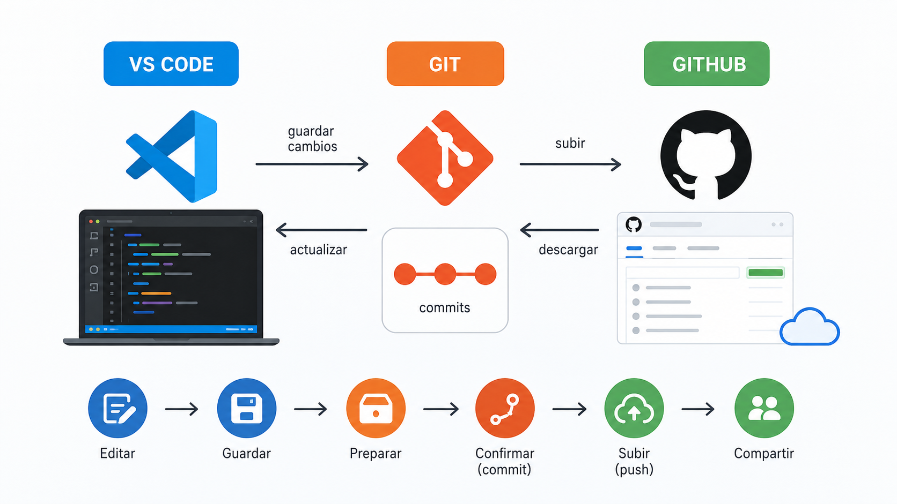

<p align="center">
  
</p>


# Guía práctica de Git, GitHub y VS Code para crear un repositorio

> Guía pensada para personas sin conocimientos de IT, pero útil también para quienes ya tienen experiencia y quieren ordenar conceptos. Empieza con lenguaje cotidiano y avanza poco a poco hacia los conceptos técnicos mínimos necesarios.

**Última revisión:** 2026-05-29  
**Uso recomendado:** copia este archivo en tu repositorio como `README.md` o como `GUIA_GIT_GITHUB_VSCODE.md`.

---

<a id="indice"></a>
## Índice

1. [La idea en lenguaje de calle](#1-la-idea-en-lenguaje-de-calle)
2. [Qué problema resuelven Git, GitHub y VS Code](#2-que-problema-resuelven-git-github-y-vs-code)
3. [Qué es cada cosa: Git, GitHub y VS Code](#3-que-es-cada-cosa-git-github-y-vs-code)
4. [Qué puede hacer y qué no puede hacer cada herramienta](#4-que-puede-hacer-y-que-no-puede-hacer-cada-herramienta)
5. [Conceptos mínimos antes de tocar botones](#5-conceptos-minimos-antes-de-tocar-botones)
6. [Mapa mental rápido: de tu ordenador a GitHub](#6-mapa-mental-rapido-de-tu-ordenador-a-github)
7. [Antes de empezar: requisitos](#7-antes-de-empezar-requisitos)
8. [Ruta recomendada para principiantes: crear el repositorio en GitHub y clonarlo en VS Code](#8-ruta-recomendada-para-principiantes-crear-el-repositorio-en-github-y-clonarlo-en-vs-code)
9. [Ruta alternativa: crear el repositorio desde VS Code y publicarlo en GitHub](#9-ruta-alternativa-crear-el-repositorio-desde-vs-code-y-publicarlo-en-github)
10. [Ruta con terminal: crear un repositorio con comandos](#10-ruta-con-terminal-crear-un-repositorio-con-comandos)
11. [Flujo diario recomendado](#11-flujo-diario-recomendado)
12. [Los comandos esenciales de Git](#12-los-comandos-esenciales-de-git)
13. [Cómo entender los estados de los archivos](#13-como-entender-los-estados-de-los-archivos)
14. [Ramas: trabajar sin romper lo principal](#14-ramas-trabajar-sin-romper-lo-principal)
15. [Pull requests: proponer cambios antes de mezclarlos](#15-pull-requests-proponer-cambios-antes-de-mezclarlos)
16. [Conflictos: qué son y cómo resolverlos](#16-conflictos-que-son-y-como-resolverlos)
17. [Qué archivos conviene subir y cuáles no](#17-que-archivos-conviene-subir-y-cuales-no)
18. [El archivo `.gitignore`](#18-el-archivo-gitignore)
19. [Cómo escribir buenos commits](#19-como-escribir-buenos-commits)
20. [Cómo estructurar un buen README](#20-como-estructurar-un-buen-readme)
21. [Seguridad básica: errores que conviene evitar](#21-seguridad-basica-errores-que-conviene-evitar)
22. [Cómo puede ayudarte la IA o un LLM](#22-como-puede-ayudarte-la-ia-o-un-llm)
23. [Errores frecuentes y solución rápida](#23-errores-frecuentes-y-solucion-rapida)
24. [Ejercicios progresivos](#24-ejercicios-progresivos)
25. [Glosario mínimo](#25-glosario-minimo)
26. [Chuleta rápida](#26-chuleta-rapida)
27. [Recursos oficiales](#27-recursos-oficiales)

---

<a id="1-la-idea-en-lenguaje-de-calle"></a>
## 1. La idea en lenguaje de calle

Imagina que estás escribiendo un documento importante. Al principio lo guardas como:

- `trabajo.docx`
- `trabajo_final.docx`
- `trabajo_final_bueno.docx`
- `trabajo_final_ahora_si.docx`
- `trabajo_final_definitivo_revisado_v3.docx`

Eso es humano, pero se vuelve un caos.

**Git** aparece para evitar ese caos. En vez de tener cien copias con nombres raros, Git guarda la historia ordenada de tu proyecto. Puedes saber qué cambió, cuándo cambió, quién lo cambió y por qué.

**GitHub** es como una copia online de ese proyecto, pero con herramientas para colaborar, revisar cambios, documentar, publicar versiones y trabajar en equipo.

**VS Code** es el programa donde editas los archivos. Es como tu mesa de trabajo. Además, se conecta con Git y GitHub para que no tengas que hacerlo todo desde una pantalla negra de comandos.

Dicho de forma sencilla:

| Herramienta | Explicación cotidiana |
|---|---|
| Git | La memoria del proyecto |
| GitHub | La nube y zona de colaboración del proyecto |
| VS Code | El editor donde trabajas los archivos |

[Volver al índice](#indice)

---

<a id="2-que-problema-resuelven-git-github-y-vs-code"></a>
## 2. Qué problema resuelven Git, GitHub y VS Code

Cuando trabajas con archivos, código, apuntes, documentación, una web, un curso o un proyecto de IA, tarde o temprano aparecen problemas:

- Has cambiado algo y ahora no funciona.
- Quieres volver a una versión anterior.
- Varias personas modifican el mismo proyecto.
- No sabes quién tocó un archivo.
- Quieres probar una idea sin romper el trabajo principal.
- Necesitas compartir el proyecto con otras personas.
- Quieres publicar documentación o código de forma ordenada.

Git, GitHub y VS Code trabajan juntos para resolver esto.

La idea básica es:

1. Editas archivos en tu ordenador con VS Code.
2. Git registra los cambios importantes.
3. GitHub guarda una copia remota y permite colaborar.
4. Cuando otras personas cambian algo, puedes traer sus cambios.
5. Cuando tú cambias algo, puedes subir tus cambios.

[Volver al índice](#indice)

---

<a id="3-que-es-cada-cosa-git-github-y-vs-code"></a>
## 3. Qué es cada cosa: Git, GitHub y VS Code

### Git

Git es un sistema de control de versiones distribuido. En lenguaje simple: es una herramienta que guarda la evolución de un proyecto.

No guarda únicamente “el archivo final”. Guarda una secuencia de puntos de control llamados **commits**.

Un commit es como decir:

> “En este momento, el proyecto estaba así, y dejo una nota explicando qué cambié”.

### GitHub

GitHub es una plataforma online donde puedes alojar repositorios Git.

Un **repositorio** es una carpeta de proyecto con historial. Puede contener código, documentación, imágenes, configuraciones, notebooks, páginas web, ejercicios, datos pequeños, etc.

GitHub añade herramientas encima de Git:

- Repositorios públicos o privados.
- Colaboradores.
- Issues para tareas, errores o ideas.
- Pull requests para revisar cambios antes de unirlos.
- Wiki y documentación.
- GitHub Pages para publicar webs sencillas.
- GitHub Actions para automatizar procesos.
- Integraciones con IA, editores, despliegue y otras herramientas.

### VS Code

Visual Studio Code, normalmente llamado VS Code, es un editor de código y texto técnico.

Sirve para editar archivos, navegar carpetas, usar extensiones, abrir terminales y trabajar con Git desde una interfaz gráfica.

VS Code no sustituye a Git. Normalmente usa Git por debajo. Es decir, cuando pulsas botones como **Commit**, **Sync**, **Pull** o **Push**, VS Code está ejecutando operaciones de Git de forma más visual.

[Volver al índice](#indice)

---

<a id="4-que-puede-hacer-y-que-no-puede-hacer-cada-herramienta"></a>
## 4. Qué puede hacer y qué no puede hacer cada herramienta

### Git: qué puede hacer

Git puede:

- Guardar versiones del proyecto.
- Mostrar qué cambió entre una versión y otra.
- Volver a versiones anteriores.
- Crear ramas para probar ideas sin romper la versión principal.
- Mezclar cambios de distintas ramas.
- Ayudar a colaborar con otras personas.
- Registrar autor, fecha y mensaje de cada cambio.

### Git: qué no puede hacer

Git no puede:

- Saber si tu proyecto “está bien” desde el punto de vista de negocio, diseño o pedagogía.
- Arreglar automáticamente una mala organización.
- Evitar que subas secretos si tú los añades al repositorio.
- Sustituir una copia de seguridad completa si nunca subes los cambios a otro sitio.
- Gestionar bien archivos enormes o binarios pesados sin herramientas adicionales.
- Entender el significado humano de tus cambios si escribes mensajes de commit confusos.

### GitHub: qué puede hacer

GitHub puede:

- Guardar tu repositorio online.
- Permitir colaboración entre personas.
- Mostrar el historial del proyecto en la web.
- Gestionar tareas, errores y propuestas con issues.
- Revisar cambios con pull requests.
- Publicar documentación.
- Automatizar pruebas, despliegues o tareas repetitivas con GitHub Actions.
- Servir como portfolio técnico o educativo.

### GitHub: qué no puede hacer

GitHub no puede:

- Garantizar que tu código funcione.
- Garantizar que tu documentación sea clara.
- Protegerte si publicas contraseñas, claves privadas o datos sensibles.
- Reemplazar una estrategia de seguridad.
- Resolver automáticamente conflictos complejos de colaboración.
- Convertir un proyecto desordenado en un proyecto ordenado sin criterio humano.

### VS Code: qué puede hacer

VS Code puede:

- Editar archivos de muchos lenguajes.
- Mostrar cambios de Git visualmente.
- Hacer commits desde la interfaz.
- Sincronizar con GitHub.
- Abrir una terminal integrada.
- Instalar extensiones útiles.
- Ayudarte a resolver conflictos.
- Conectarse con GitHub y otras plataformas.

### VS Code: qué no puede hacer

VS Code no puede:

- Reemplazar el aprendizaje mínimo de Git.
- Saber siempre qué cambio quieres conservar en un conflicto.
- Evitar errores si pulsas botones sin entender el flujo.
- Convertirse por sí solo en una metodología de trabajo.
- Hacer que un repositorio sea seguro si subes archivos sensibles.

[Volver al índice](#indice)

---

<a id="5-conceptos-minimos-antes-de-tocar-botones"></a>
## 5. Conceptos mínimos antes de tocar botones

Estos conceptos son los que más confunden al principio. Conviene entenderlos con calma.

### Repositorio

Un repositorio es una carpeta de proyecto con historial Git.

Puede estar:

- En tu ordenador: **repositorio local**.
- En GitHub: **repositorio remoto**.

### Commit

Un commit es un punto de control.

No es simplemente “guardar”. Guardar es lo que haces en tu editor. Commit es decirle a Git:

> “Este conjunto de cambios tiene sentido y quiero dejarlo registrado en la historia del proyecto”.

### Stage o área de preparación

Antes de hacer un commit, eliges qué cambios entran en ese commit. A eso se le llama **stage**, **staging area** o **área de preparación**.

Analogía:

- Tienes muchos papeles sobre la mesa.
- Seleccionas algunos para meterlos en un sobre.
- Escribes una etiqueta en el sobre.
- Guardas el sobre en el archivo histórico.

En Git:

- Papeles sobre la mesa = cambios hechos.
- Meter en el sobre = `git add`.
- Etiqueta del sobre = mensaje de commit.
- Guardar el sobre = `git commit`.

### Push

`push` significa subir tus commits desde tu ordenador a GitHub.

### Pull

`pull` significa traer cambios desde GitHub a tu ordenador e integrarlos en tu copia local.

### Clone

`clone` significa copiar un repositorio remoto, por ejemplo desde GitHub, a tu ordenador.

### Branch o rama

Una rama es una línea de trabajo independiente.

Sirve para probar, desarrollar o corregir algo sin tocar directamente la rama principal.

### Merge

`merge` significa mezclar una rama con otra.

Por ejemplo: cuando terminas una mejora en una rama secundaria, puedes mezclarla en la rama principal.

### Conflict o conflicto

Un conflicto ocurre cuando Git no puede decidir automáticamente qué cambio conservar.

Ejemplo típico:

- Persona A cambia una frase.
- Persona B cambia la misma frase.
- Git pregunta: “¿Cuál de las dos versiones vale?”.

[Volver al índice](#indice)

---

<a id="6-mapa-mental-rapido-de-tu-ordenador-a-github"></a>
## 6. Mapa mental rápido: de tu ordenador a GitHub

Este es el viaje habitual de un cambio:

```text
Tu carpeta en el ordenador
        ↓
Editas archivos con VS Code
        ↓
Git detecta cambios
        ↓
Seleccionas cambios para preparar el commit
        ↓
Haces commit con un mensaje claro
        ↓
Subes los commits a GitHub con push
        ↓
GitHub muestra el proyecto actualizado
```

Y cuando alguien ha cambiado algo en GitHub:

```text
GitHub tiene cambios nuevos
        ↓
Traes esos cambios con pull
        ↓
Tu carpeta local se actualiza
        ↓
Sigues trabajando desde la versión actualizada
```

[Volver al índice](#indice)

---

<a id="7-antes-de-empezar-requisitos"></a>
## 7. Antes de empezar: requisitos

Para seguir esta guía necesitas:

1. Una cuenta en GitHub.
2. Git instalado en tu ordenador.
3. VS Code instalado.
4. Conexión a internet.
5. Una carpeta de proyecto.

### Comprobar si Git está instalado

Abre la terminal de VS Code o la terminal de tu sistema y escribe:

```bash
git --version
```

Si aparece una versión, Git está instalado.

Si no aparece, instala Git desde la web oficial:

```text
https://git-scm.com/
```

### Configurar tu nombre y correo en Git

Git necesita saber quién eres para firmar tus commits.

```bash
git config --global user.name "Tu Nombre"
git config --global user.email "tu-email@example.com"
```

Comprueba la configuración:

```bash
git config --global --list
```

### Autenticación con GitHub

Para conectar Git con GitHub necesitas autenticarte. Normalmente usarás una de estas opciones:

| Método | Para quién es recomendable |
|---|---|
| Iniciar sesión desde VS Code | Principiantes |
| HTTPS con navegador/token | Uso común |
| GitHub CLI | Usuarios intermedios |
| SSH | Usuarios intermedios o avanzados |

Para empezar, lo más sencillo suele ser iniciar sesión desde VS Code cuando el editor te lo pida.

Importante: GitHub no funciona como “meter la contraseña de tu cuenta” cada vez que haces operaciones Git por terminal. Según el método, se usa autenticación mediante navegador, token, GitHub CLI o claves SSH.

[Volver al índice](#indice)

---

<a id="8-ruta-recomendada-para-principiantes-crear-el-repositorio-en-github-y-clonarlo-en-vs-code"></a>
## 8. Ruta recomendada para principiantes: crear el repositorio en GitHub y clonarlo en VS Code

Esta es la ruta más clara para empezar.

### Paso 1: crear el repositorio en GitHub

1. Entra en GitHub.
2. Pulsa el botón **New repository** o ve a la opción de crear repositorio.
3. Escribe un nombre corto y claro.

Ejemplos:

```text
mi-primer-repositorio
curso-ia
apuntes-python
web-personal
proyecto-datos
```

4. Elige visibilidad:

| Opción | Qué significa |
|---|---|
| Public | Cualquiera puede ver el repositorio |
| Private | Solo tú y las personas invitadas pueden verlo |

5. Marca la opción de crear un `README.md` si quieres empezar con un archivo de presentación.
6. Pulsa **Create repository**.

### Paso 2: clonar el repositorio en VS Code

Clonar significa traer una copia del repositorio a tu ordenador.

En VS Code:

1. Abre VS Code.
2. Abre la paleta de comandos:
   - Windows/Linux: `Ctrl + Shift + P`
   - macOS: `Cmd + Shift + P`
3. Escribe: `Git: Clone`.
4. Pega la URL del repositorio de GitHub.
5. Elige una carpeta de tu ordenador donde guardar el proyecto.
6. Cuando VS Code pregunte si quieres abrir el repositorio clonado, acepta.

### Paso 3: modificar un archivo

Por ejemplo, abre `README.md` y escribe:

```markdown
# Mi primer repositorio

Este repositorio es mi primera práctica con Git, GitHub y VS Code.
```

Guarda el archivo.

### Paso 4: revisar cambios en VS Code

En la barra lateral izquierda de VS Code, abre el icono de **Source Control**.

Verás el archivo modificado.

Puedes pulsar sobre el archivo para ver qué líneas han cambiado.

### Paso 5: preparar los cambios

Pulsa el símbolo `+` junto al archivo modificado. Eso equivale a preparar el cambio para el commit.

También puedes preparar todos los cambios de golpe con el `+` general.

### Paso 6: escribir un mensaje de commit

Escribe un mensaje corto y claro:

```text
Actualiza README inicial
```

Después pulsa **Commit**.

### Paso 7: subir los cambios a GitHub

Pulsa **Sync Changes**, **Push** o la opción equivalente que muestre VS Code.

Después entra en GitHub y comprueba que el archivo aparece actualizado.

Has completado el ciclo básico:

```text
editar → preparar → commit → push
```

[Volver al índice](#indice)

---

<a id="9-ruta-alternativa-crear-el-repositorio-desde-vs-code-y-publicarlo-en-github"></a>
## 9. Ruta alternativa: crear el repositorio desde VS Code y publicarlo en GitHub

Esta ruta es útil cuando ya tienes una carpeta local con archivos y quieres convertirla en repositorio.

### Paso 1: abrir la carpeta en VS Code

1. Abre VS Code.
2. Ve a **File > Open Folder**.
3. Selecciona la carpeta de tu proyecto.

### Paso 2: inicializar Git

1. Abre la vista **Source Control**.
2. Pulsa **Initialize Repository**.

Esto crea una carpeta oculta llamada `.git`. Esa carpeta contiene la información interna del repositorio.

No hace falta tocarla manualmente.

### Paso 3: crear o modificar archivos

Crea, por ejemplo, un archivo `README.md`:

```markdown
# Mi proyecto

Descripción breve del proyecto.
```

### Paso 4: hacer el primer commit

1. En Source Control, prepara los archivos con `+`.
2. Escribe un mensaje:

```text
Primer commit
```

3. Pulsa **Commit**.

### Paso 5: publicar en GitHub

VS Code puede mostrar una opción tipo **Publish Branch** o **Publish to GitHub**.

1. Pulsa esa opción.
2. Inicia sesión en GitHub si lo pide.
3. Elige si el repositorio será público o privado.
4. Publica.

Después de esto, el repositorio existirá tanto en tu ordenador como en GitHub.

[Volver al índice](#indice)

---

<a id="10-ruta-con-terminal-crear-un-repositorio-con-comandos"></a>
## 10. Ruta con terminal: crear un repositorio con comandos

Esta ruta es más técnica. No es obligatoria para empezar, pero ayuda a entender qué ocurre por debajo.

### Crear un proyecto desde cero

```bash
mkdir mi-proyecto
cd mi-proyecto
git init
```

Crea un archivo `README.md`:

```bash
echo "# Mi proyecto" > README.md
```

Prepara el archivo:

```bash
git add README.md
```

Crea el primer commit:

```bash
git commit -m "Primer commit"
```

Cambia el nombre de la rama principal a `main`, si hace falta:

```bash
git branch -M main
```

Conecta con un repositorio remoto de GitHub:

```bash
git remote add origin https://github.com/USUARIO/mi-proyecto.git
```

Sube el proyecto:

```bash
git push -u origin main
```

### Aviso importante

Este flujo funciona mejor si el repositorio de GitHub está vacío.

Si en GitHub ya creaste un `README.md`, una licencia o un `.gitignore`, entonces el repositorio remoto ya tiene commits. En ese caso, para principiantes suele ser más fácil **clonar primero** el repositorio en vez de crear uno local y conectarlo después.

[Volver al índice](#indice)

---

<a id="11-flujo-diario-recomendado"></a>
## 11. Flujo diario recomendado

Cuando ya tienes el repositorio creado, este es un buen hábito de trabajo.

### Al empezar

Trae los últimos cambios:

```bash
git pull
```

O en VS Code, pulsa la opción de sincronizar/actualizar si aparece.

### Mientras trabajas

Edita archivos normalmente.

Revisa qué has cambiado:

```bash
git status
git diff
```

En VS Code puedes verlo visualmente desde Source Control.

### Al terminar una unidad de trabajo

Prepara cambios:

```bash
git add .
```

Crea un commit:

```bash
git commit -m "Describe el cambio de forma clara"
```

Sube a GitHub:

```bash
git push
```

### Fórmula mental

```text
Antes de trabajar: pull
Durante el trabajo: editar y revisar
Cuando algo tiene sentido: commit
Para compartirlo: push
```

[Volver al índice](#indice)

---

<a id="12-los-comandos-esenciales-de-git"></a>
## 12. Los comandos esenciales de Git

No necesitas memorizar todos los comandos. Empieza por estos.

| Comando | Para qué sirve |
|---|---|
| `git --version` | Comprueba si Git está instalado |
| `git init` | Convierte una carpeta en repositorio Git |
| `git clone URL` | Copia un repositorio remoto a tu ordenador |
| `git status` | Muestra el estado de los archivos |
| `git add archivo` | Prepara un archivo para el commit |
| `git add .` | Prepara todos los cambios de la carpeta actual |
| `git commit -m "mensaje"` | Crea un punto de control con mensaje |
| `git log` | Muestra el historial de commits |
| `git diff` | Muestra diferencias no preparadas |
| `git branch` | Lista ramas |
| `git switch nombre-rama` | Cambia de rama |
| `git switch -c nueva-rama` | Crea y cambia a una rama nueva |
| `git pull` | Trae e integra cambios del remoto |
| `git push` | Sube tus commits al remoto |
| `git remote -v` | Muestra la conexión con repositorios remotos |

### El mínimo real para principiantes

Si estás empezando, quédate con este ciclo:

```bash
git status
git add .
git commit -m "Mensaje claro"
git push
```

Y antes de empezar a trabajar:

```bash
git pull
```

[Volver al índice](#indice)

---

<a id="13-como-entender-los-estados-de-los-archivos"></a>
## 13. Cómo entender los estados de los archivos

Git clasifica los archivos según su estado.

| Estado | Qué significa |
|---|---|
| Untracked | Git ve el archivo, pero aún no lo sigue |
| Modified | El archivo ya existía y ha sido modificado |
| Staged | El cambio está preparado para el próximo commit |
| Committed | El cambio ya forma parte del historial local |
| Pushed | El commit ya está subido al repositorio remoto |

Flujo visual:

```text
Untracked / Modified
        ↓ git add
Staged
        ↓ git commit
Committed en local
        ↓ git push
Publicado en GitHub
```

Esto es clave: **guardar un archivo no es lo mismo que hacer commit**.

Y hacer commit no es lo mismo que subir a GitHub.

[Volver al índice](#indice)

---

<a id="14-ramas-trabajar-sin-romper-lo-principal"></a>
## 14. Ramas: trabajar sin romper lo principal

Una rama permite trabajar en paralelo.

La rama principal suele llamarse `main`.

Imagina que `main` es la versión estable de tu proyecto. Si quieres probar una idea, creas una rama:

```bash
git switch -c mejora-readme
```

Trabajas ahí, haces commits, y cuando esté listo puedes mezclarlo con `main`.

### Por qué usar ramas

Usa ramas para:

- Probar una idea.
- Añadir una funcionalidad.
- Corregir un error.
- Reorganizar documentación.
- Trabajar sin bloquear a otras personas.

### Nombres recomendados de ramas

```text
feature/nueva-seccion
fix/error-en-readme
docs/actualiza-guia
experiment/prueba-modelo-ia
```

### Comandos básicos de ramas

Ver ramas:

```bash
git branch
```

Crear una rama y moverte a ella:

```bash
git switch -c nombre-rama
```

Cambiar a otra rama:

```bash
git switch main
```

Subir una rama nueva a GitHub:

```bash
git push -u origin nombre-rama
```

[Volver al índice](#indice)

---

<a id="15-pull-requests-proponer-cambios-antes-de-mezclarlos"></a>
## 15. Pull requests: proponer cambios antes de mezclarlos

Un pull request, normalmente abreviado como PR, es una propuesta de cambio.

Sirve para decir:

> “He hecho estos cambios en una rama. ¿Los revisamos antes de unirlos a la rama principal?”.

### Para qué sirve un pull request

Un PR permite:

- Revisar cambios antes de aceptarlos.
- Conversar sobre líneas concretas.
- Pedir mejoras.
- Ejecutar pruebas automáticas.
- Documentar decisiones.
- Mantener estable la rama principal.

### Flujo típico con pull request

```text
main
 ↓
creas rama nueva
 ↓
haces cambios
 ↓
haces commits
 ↓
subes la rama a GitHub
 ↓
abres pull request
 ↓
se revisa
 ↓
se aprueba
 ↓
se mezcla en main
```

Para proyectos individuales no siempre necesitas PR, pero es buena práctica aprenderlos pronto.

[Volver al índice](#indice)

---

<a id="16-conflictos-que-son-y-como-resolverlos"></a>
## 16. Conflictos: qué son y cómo resolverlos

Un conflicto aparece cuando Git no puede mezclar cambios automáticamente.

Ejemplo:

Archivo original:

```text
El curso empieza el lunes.
```

Persona A cambia:

```text
El curso empieza el martes.
```

Persona B cambia:

```text
El curso empieza el miércoles.
```

Git no sabe qué frase es la correcta.

### Cómo se ve un conflicto

A veces verás marcas como estas dentro del archivo:

```text
<<<<<<< HEAD
El curso empieza el martes.
=======
El curso empieza el miércoles.
>>>>>>> rama-de-otra-persona
```

Tu trabajo es decidir el resultado final:

```text
El curso empieza el miércoles.
```

O incluso combinar ambas ideas:

```text
El curso empieza el martes para docentes y el miércoles para estudiantes.
```

### Cómo resolver conflictos en VS Code

VS Code suele mostrar opciones como:

- Accept Current Change.
- Accept Incoming Change.
- Accept Both Changes.
- Compare Changes.

No pulses al azar. Lee el contenido y decide qué versión tiene sentido.

### Buenas prácticas para evitar conflictos

- Haz `pull` antes de empezar.
- Haz commits pequeños.
- Comunica qué archivos tocará cada persona.
- Evita que varias personas editen a la vez el mismo bloque de texto.
- Usa ramas y pull requests.

[Volver al índice](#indice)

---

<a id="17-que-archivos-conviene-subir-y-cuales-no"></a>
## 17. Qué archivos conviene subir y cuáles no

No todo debe ir a un repositorio.

### Conviene subir

- Código fuente.
- Documentación.
- Archivos Markdown.
- Configuraciones necesarias para ejecutar el proyecto.
- Ejemplos pequeños.
- Tests.
- Plantillas.
- Imágenes ligeras necesarias para la documentación.

### No conviene subir

- Contraseñas.
- Tokens.
- Claves API.
- Archivos `.env` con secretos reales.
- Datos personales.
- Bases de datos privadas.
- Archivos enormes.
- Carpetas generadas automáticamente.
- Dependencias descargadas que pueden reinstalarse.
- Archivos temporales del sistema operativo.

### Ejemplos de carpetas que normalmente no se suben

```text
node_modules/
.venv/
__pycache__/
dist/
build/
.DS_Store
```

[Volver al índice](#indice)

---

<a id="18-el-archivo-gitignore"></a>
## 18. El archivo `.gitignore`

El archivo `.gitignore` le dice a Git qué archivos o carpetas debe ignorar.

Ejemplo básico:

```gitignore
# Secretos y variables de entorno
.env
.env.local

# Dependencias
node_modules/
.venv/

# Python
__pycache__/
*.pyc

# Logs
*.log

# Builds
build/
dist/

# Sistema operativo
.DS_Store
Thumbs.db
```

### Importante

`.gitignore` evita que Git empiece a seguir archivos nuevos, pero si un archivo ya fue incluido en un commit anterior, añadirlo después a `.gitignore` no lo elimina automáticamente del historial.

Si subiste un secreto por error:

1. Revoca o cambia ese secreto inmediatamente.
2. Elimínalo del repositorio.
3. Limpia el historial si es necesario.
4. Consulta documentación oficial o pide ayuda técnica.

[Volver al índice](#indice)

---

<a id="19-como-escribir-buenos-commits"></a>
## 19. Cómo escribir buenos commits

Un buen commit debe ser pequeño, claro y coherente.

### Malos mensajes

```text
cambios
cosas
arreglo
update
final final
```

### Buenos mensajes

```text
Añade guía inicial de instalación
Corrige enlace roto en el README
Actualiza ejemplos de configuración
Elimina archivos temporales del proyecto
Crea estructura base del curso
```

### Regla práctica

Un mensaje de commit debería completar esta frase:

> “Este commit ______”.

Ejemplo:

> “Este commit añade guía inicial de instalación”.

### Tamaño recomendado

Mejor varios commits pequeños que uno gigante.

Ejemplo:

```text
Commit 1: Añade estructura inicial del README
Commit 2: Añade instrucciones de instalación
Commit 3: Corrige errores ortográficos
```

Peor:

```text
Commit único: cambia todo
```

[Volver al índice](#indice)

---

<a id="20-como-estructurar-un-buen-readme"></a>
## 20. Cómo estructurar un buen README

El `README.md` es la puerta de entrada a tu repositorio.

Debe responder rápido:

- Qué es este proyecto.
- Para quién es.
- Cómo se usa.
- Cómo se instala o ejecuta.
- Qué contiene.
- Cómo colaborar.

### Plantilla básica de README

```markdown
# Nombre del proyecto

Descripción breve del proyecto.

## Objetivo

Explica qué problema resuelve o qué enseña.

## Contenido

- Carpeta 1: explicación
- Carpeta 2: explicación
- Archivo importante: explicación

## Requisitos

- Requisito 1
- Requisito 2

## Uso

Pasos para usar el proyecto.

## Ejemplos

Incluye ejemplos si aplica.

## Contribuir

Explica cómo otras personas pueden proponer cambios.

## Licencia

Indica la licencia si corresponde.
```

### Para proyectos educativos

Añade también:

- Nivel recomendado.
- Duración estimada.
- Objetivos de aprendizaje.
- Materiales necesarios.
- Ejercicios.
- Soluciones o criterios de evaluación.

[Volver al índice](#indice)

---

<a id="21-seguridad-basica-errores-que-conviene-evitar"></a>
## 21. Seguridad básica: errores que conviene evitar

La seguridad es especialmente importante si usas GitHub con proyectos reales, datos, clientes, alumnado o claves de servicios online.

### No subas secretos

No subas:

```text
contraseñas
claves API
tokens
certificados privados
archivos .env reales
credenciales de bases de datos
datos personales
```

### Cuidado con repositorios públicos

Si un repositorio es público, cualquiera puede verlo.

Antes de hacerlo público, revisa:

- Archivos incluidos.
- Historial de commits.
- Configuraciones.
- Datos de ejemplo.
- Imágenes o capturas de pantalla.
- Comentarios internos.

### Usa repositorios privados cuando toque

Para formación interna, proyectos de cliente, datos sensibles o trabajo no publicado, normalmente es mejor empezar con un repositorio privado.

### No confundas borrar con eliminar del historial

Si subes una contraseña y luego la borras en otro commit, puede seguir apareciendo en el historial.

La acción correcta suele ser:

1. Cambiar o revocar la credencial.
2. Eliminarla del repositorio.
3. Limpiar historial si es necesario.
4. Revisar accesos.

### Protege la rama principal

En equipos, conviene proteger `main` para que los cambios entren mediante pull request y revisión.

[Volver al índice](#indice)

---

<a id="22-como-puede-ayudarte-la-ia-o-un-llm"></a>
## 22. Cómo puede ayudarte la IA o un LLM

Un LLM como ChatGPT puede ayudarte mucho a aprender Git, GitHub y VS Code, pero no debe sustituir tu criterio.

### Buenas formas de pedir ayuda a una IA

Puedes pedirle:

```text
Explícame este error de Git en lenguaje sencillo: [pegar error]
```

```text
Dime qué significa este resultado de git status: [pegar salida]
```

```text
Ayúdame a escribir un README para este proyecto: [descripción]
```

```text
Propón un .gitignore para un proyecto de Python y Node.js
```

```text
Revisa si este mensaje de commit es claro: [mensaje]
```

```text
Explícame paso a paso cómo resolver este conflicto sin perder cambios
```

### Qué no deberías hacer con una IA

No deberías:

- Pegar claves API, tokens o contraseñas.
- Pegar datos personales o información privada sin anonimizar.
- Ejecutar comandos peligrosos sin entenderlos.
- Copiar soluciones complejas sin leerlas.
- Pedirle que “borre todo y lo arregle” sin copia de seguridad.

### Comandos que merecen especial cuidado

Antes de ejecutar comandos como estos, asegúrate de entenderlos:

```bash
git reset --hard
git clean -fd
git push --force
git rebase
git filter-repo
git rm -r
```

No son malos comandos. Son herramientas potentes. Pero pueden borrar cambios, reescribir historial o afectar a otras personas si se usan mal.

[Volver al índice](#indice)

---

<a id="23-errores-frecuentes-y-solucion-rapida"></a>
## 23. Errores frecuentes y solución rápida

### “No sé si mis cambios están guardados”

Primero guarda el archivo en VS Code.

Luego revisa Git:

```bash
git status
```

Recuerda:

- Guardar archivo ≠ commit.
- Commit ≠ push.

### “No veo mis cambios en GitHub”

Probablemente hiciste commit, pero no hiciste push.

```bash
git push
```

### “GitHub tiene cambios que yo no tengo”

Trae los cambios:

```bash
git pull
```

### “Me pide iniciar sesión”

Debes autenticarte con GitHub. Puedes hacerlo desde VS Code, navegador, GitHub CLI, HTTPS con token o SSH.

### “Me sale un conflicto”

No te asustes. Abre el archivo, lee las dos versiones y decide qué contenido final debe quedar.

Después:

```bash
git add archivo-resuelto
git commit
```

### “He subido un archivo que no quería”

Si no contiene secretos, puedes eliminarlo y hacer otro commit:

```bash
git rm archivo
git commit -m "Elimina archivo innecesario"
git push
```

Si contiene secretos, no basta con borrarlo: cambia o revoca el secreto.

### “No sé en qué rama estoy”

```bash
git branch
```

La rama actual aparece marcada con `*`.

### “He tocado muchas cosas y quiero ver qué cambió”

```bash
git diff
```

O revisa los cambios desde Source Control en VS Code.

[Volver al índice](#indice)

---

<a id="24-ejercicios-progresivos"></a>
## 24. Ejercicios progresivos

### Nivel 0: entender sin tocar terminal

Objetivo: familiarizarse con GitHub y VS Code.

1. Crea una cuenta en GitHub.
2. Crea un repositorio público o privado.
3. Añade un `README.md` desde la web.
4. Edita el `README.md` desde GitHub.
5. Observa el historial de commits.

### Nivel 1: usar VS Code

Objetivo: completar el ciclo básico.

1. Clona el repositorio en VS Code.
2. Edita el `README.md`.
3. Guarda el archivo.
4. Abre Source Control.
5. Prepara el cambio.
6. Haz commit.
7. Haz push.
8. Comprueba el cambio en GitHub.

### Nivel 2: usar terminal mínima

Objetivo: entender los comandos básicos.

Ejecuta:

```bash
git status
git add README.md
git commit -m "Actualiza README con ejercicio"
git push
```

### Nivel 3: trabajar con ramas

Objetivo: no tocar directamente `main`.

```bash
git switch -c docs/nueva-seccion
```

Añade una sección al README, haz commit y sube la rama:

```bash
git add .
git commit -m "Añade nueva sección de documentación"
git push -u origin docs/nueva-seccion
```

Abre un pull request en GitHub.

### Nivel 4: colaboración

Objetivo: simular trabajo en equipo.

1. Invita a otra persona al repositorio.
2. Cada persona crea una rama.
3. Cada persona cambia archivos distintos.
4. Abrid pull requests.
5. Revisad los cambios.
6. Mezcladlos en `main`.

### Nivel 5: conflicto controlado

Objetivo: aprender a resolver conflictos sin miedo.

1. Dos personas editan la misma línea del mismo archivo en ramas distintas.
2. Una rama se mezcla primero.
3. La otra generará conflicto.
4. Resolved el conflicto en VS Code.
5. Haced commit del resultado.

[Volver al índice](#indice)

---

<a id="25-glosario-minimo"></a>
## 25. Glosario mínimo

| Término | Significado sencillo |
|---|---|
| Git | Herramienta que guarda el historial de cambios |
| GitHub | Plataforma online para alojar y colaborar en repositorios Git |
| VS Code | Editor donde modificas archivos y puedes usar Git visualmente |
| Repositorio | Carpeta de proyecto con historial |
| Local | Lo que está en tu ordenador |
| Remoto | Lo que está en GitHub u otro servidor |
| Commit | Punto de control en la historia del proyecto |
| Stage | Área donde preparas cambios antes del commit |
| Push | Subir commits al remoto |
| Pull | Traer e integrar cambios del remoto |
| Clone | Copiar un repositorio remoto a tu ordenador |
| Branch | Rama de trabajo independiente |
| Main | Rama principal habitual |
| Merge | Mezclar cambios de una rama en otra |
| Conflict | Situación en la que Git necesita que una persona decida qué cambio conservar |
| Pull request | Propuesta de cambio para revisar antes de mezclar |
| `.gitignore` | Archivo que indica qué debe ignorar Git |
| README | Archivo principal de explicación del repositorio |
| Issue | Tarea, error, pregunta o propuesta dentro de GitHub |
| Fork | Copia de un repositorio en tu propia cuenta |
| Tag | Marca en un punto concreto del historial, normalmente para versiones |
| Release | Publicación formal de una versión del proyecto |

[Volver al índice](#indice)

---

<a id="26-chuleta-rapida"></a>
## 26. Chuleta rápida

### Crear repositorio desde GitHub y clonarlo

```text
GitHub → New repository → Create repository
VS Code → Git: Clone → pegar URL → abrir carpeta
```

### Ciclo básico

```bash
git status
git add .
git commit -m "Mensaje claro"
git push
```

### Antes de empezar a trabajar

```bash
git pull
```

### Crear rama

```bash
git switch -c nombre-rama
```

### Cambiar de rama

```bash
git switch main
```

### Ver historial

```bash
git log --oneline
```

### Ver remoto conectado

```bash
git remote -v
```

### Mensajes de commit útiles

```text
Añade...
Corrige...
Actualiza...
Elimina...
Refactoriza...
Documenta...
```

### Regla de oro

```text
No subas secretos. Haz commits pequeños. Escribe mensajes claros. Haz pull antes de trabajar. Haz push para compartir.
```

[Volver al índice](#indice)

---

<a id="27-recursos-oficiales"></a>
## 27. Recursos oficiales

Estos recursos son los puntos de referencia recomendados para ampliar o verificar conceptos.

### Git

- [Documentación oficial de Git](https://git-scm.com/docs/git)
- [Documentación oficial de Git en español](https://git-scm.com/docs/git/es)
- [Tutorial oficial de Git](https://git-scm.com/docs/gittutorial)
- [Glosario oficial de Git](https://git-scm.com/docs/gitglossary)

### GitHub

- [Crear un nuevo repositorio en GitHub](https://docs.github.com/en/repositories/creating-and-managing-repositories/creating-a-new-repository)
- [Quickstart de repositorios en GitHub](https://docs.github.com/en/repositories/creating-and-managing-repositories/quickstart-for-repositories)
- [Acerca de los repositorios en GitHub](https://docs.github.com/en/repositories/creating-and-managing-repositories/about-repositories)
- [Configurar Git para trabajar con GitHub](https://docs.github.com/en/get-started/git-basics/set-up-git)
- [Autenticación en GitHub](https://docs.github.com/en/authentication/keeping-your-account-and-data-secure/about-authentication-to-github)
- [Conectar con GitHub mediante SSH](https://docs.github.com/en/authentication/connecting-to-github-with-ssh)

### VS Code

- [Source Control en VS Code](https://code.visualstudio.com/docs/sourcecontrol/overview)
- [Quickstart de control de versiones en VS Code](https://code.visualstudio.com/docs/sourcecontrol/quickstart)
- [Trabajar con repositorios y remotos en VS Code](https://code.visualstudio.com/docs/sourcecontrol/repos-remotes)
- [Solución de problemas de Source Control en VS Code](https://code.visualstudio.com/docs/sourcecontrol/troubleshooting)

[Volver al índice](#indice)

---

## Cierre

Git, GitHub y VS Code no son solo herramientas para programadores. Son una forma de trabajar con orden, historial y colaboración.

La curva inicial puede parecer rara porque introduce palabras nuevas: commit, push, pull, branch, merge. Pero la idea central es sencilla:

```text
Trabajo en archivos → guardo puntos de control → comparto cambios → colaboro con seguridad
```

Empieza con lo básico. Usa VS Code para ver los cambios visualmente. Aprende cinco comandos. Haz commits pequeños. No subas secretos. Y cuando algo falle, lee el mensaje de error: Git suele decir qué necesita, aunque al principio lo diga en un idioma poco amable.
