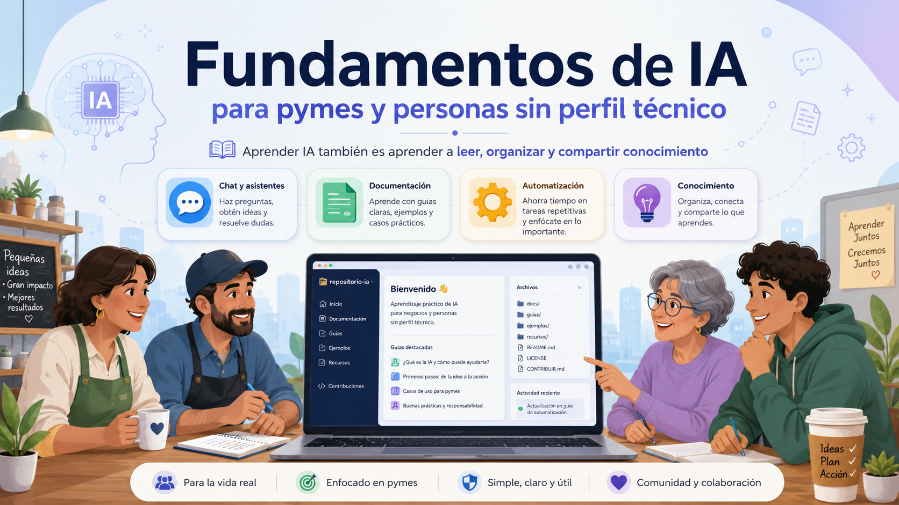

<p align="center">
  
</p>


# Formación IA

Repositorio de contenidos para un curso de IA generativa dirigido a personas no técnicas.

El objetivo del material es explicar herramientas, usos y límites de la IA con lenguaje claro, ejemplos prácticos y criterio operativo. No se plantea como documentación comercial de herramientas, sino como una base formativa para aprender a usar IA con revisión humana, control de datos y sentido crítico.

## Índice

1. [Enfoque del curso](#enfoque-del-curso)
2. [Estructura del repositorio](#estructura-del-repositorio)
3. [Contenidos actuales](#contenidos-actuales)
4. [Criterios de calidad](#criterios-de-calidad)
5. [Flujo de trabajo recomendado](#flujo-de-trabajo-recomendado)
6. [Estado](#estado)

## Enfoque del curso

- Explicar conceptos de IA generativa sin asumir conocimientos técnicos previos.
- Diferenciar herramienta, modelo, aplicación, API, asistente y agente.
- Trabajar con ejemplos aplicables a estudio, docencia, oficina, empresa y proyectos sencillos.
- Insistir en verificación, privacidad, seguridad, costes y dependencia de proveedores.
- Separar prototipo de producción.
- Usar GitHub como repositorio de contenidos y trazabilidad del curso.

## Estructura del repositorio

| Carpeta | Contenido |
|---|---|
| `IA GENERALISTAS/` | Material introductorio sobre asistentes generalistas como ChatGPT y Gemini. |
| `INVESTIGACIÓN/` | Herramientas para trabajar con fuentes, documentos y análisis, como NotebookLM. |
| `CODIGO/` | Guías para VS Code, Git, GitHub y Codex orientadas a principiantes. |
| `PROYECTO/` | Plantillas y estructura para preparar el proyecto práctico final. |
| `AUTOMATIZACIÓN/` | Espacio reservado para contenidos sobre flujos, conectores y automatizaciones. |
| `IMAGEN Y DISEÑO/` | Herramientas visuales, generación de imágenes y diseño de recursos con IA. |
| `VIDEO/` | Espacio reservado para contenidos de vídeo, audio o material multimedia. |
| `TEORIA/` | Material sobre teoría de LLM y modelos. |

## Contenidos actuales

### IA generalistas

- [Qué es ChatGPT](IA%20GENERALISTAS/que_es_chatgpt.md)
- [Qué es Gemini](IA%20GENERALISTAS/que_es_gemini.md)

### Investigación

- [Qué es NotebookLM](INVESTIGACI%C3%93N/notebooklm.md)

### Código y trabajo con repositorios

- [VS Code, Git, GitHub y Codex: guía progresiva](CODIGO/vscode_git_github_codex_guia.md)

### Imagen y diseño

- [Generación de imágenes con IA: ChatGPT, Gemini y Canva](IMAGEN%20Y%20DISE%C3%91O/chargpt_gemini_canva.md)

### Proyecto final

- [Estructura recomendada para la presentación final](PROYECTO/ejemplo_estructura_presentacion_proyecto_ia.md)

### Teoria

- [Tokens e Hiperparámetros](TEORIA/tokens_temperatura_topk_topp.md)
- [APIS](TEORIA/concepto-api-llm.md)

## Criterios de calidad

Antes de usar o ampliar un contenido del curso:

- No presentar la IA como una fuente infalible.
- Indicar límites, riesgos y necesidad de revisión humana.
- Evitar afirmar precios, funciones actuales o condiciones de herramientas sin verificarlas.
- No incluir datos personales, credenciales ni información confidencial.
- Usar ejemplos sencillos, realistas y reutilizables en clase.
- Mantener redacción clara, directa y orientada a personas no técnicas.

## Flujo de trabajo recomendado

```bash
git status
git pull --rebase
git add .
git commit -m "Describe el cambio realizado"
git push
```

Para cambios amplios, revisar siempre el diff antes de hacer commit:

```bash
git diff
```

## Estado

Repositorio en construcción. Los módulos pendientes se irán completando de forma incremental.
