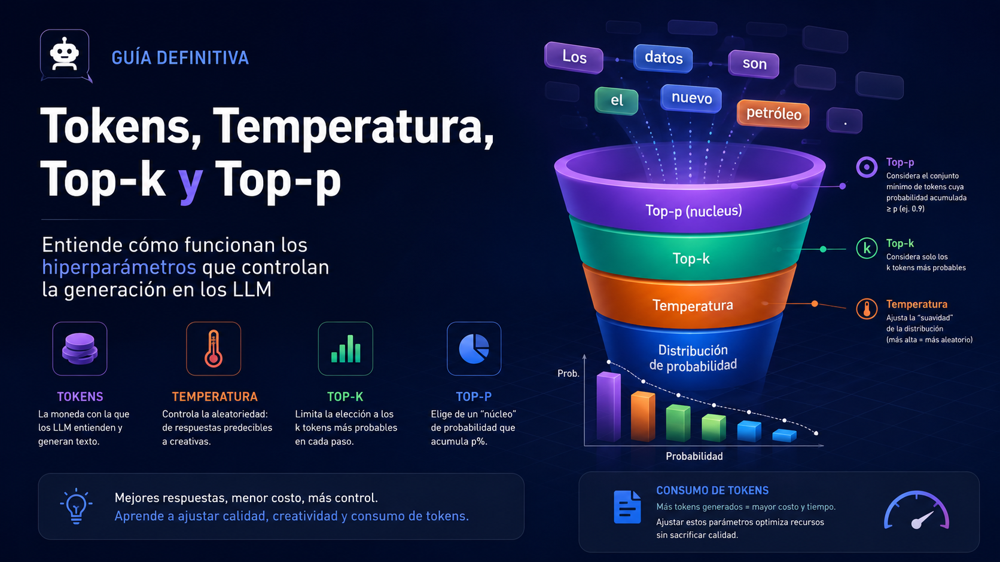

<p align="center">
  
</p>

---
title: "Tokens, temperatura, top-k y top-p en LLMs"
description: "Guía progresiva para entender consumo de tokens y parámetros de muestreo en modelos de lenguaje."
tags: [llm, tokens, temperatura, top-k, top-p, sampling, ia-generativa]
last_updated: "2026-05-28"
---


# Tokens, temperatura, top-k y top-p en LLMs

> **Idea principal:** un LLM no escribe una respuesta entera de golpe. Va eligiendo el siguiente fragmento de texto, muchas veces llamado **token**, una y otra vez. Los parámetros `temperature`, `top_k` y `top_p` influyen en **cómo elige el siguiente token**. En cambio, el **consumo de tokens** depende sobre todo de cuántos tokens entran al modelo y cuántos tokens salen de él.

Esta guía empieza con una explicación coloquial y avanza hasta los conceptos técnicos mínimos para entender qué hacen estos parámetros, qué no hacen y cómo afectan —directa o indirectamente— al coste, la longitud y la variabilidad de las respuestas.

---

## Índice

1. [La explicación coloquial](#1-la-explicación-coloquial)
2. [Qué es un token](#2-qué-es-un-token)
3. [Qué significa consumir tokens](#3-qué-significa-consumir-tokens)
4. [Cómo genera texto un LLM](#4-cómo-genera-texto-un-llm)
5. [Dónde entran temperatura, top-k y top-p](#5-dónde-entran-temperatura-top-k-y-top-p)
6. [Temperatura](#6-temperatura)
7. [Top-k](#7-top-k)
8. [Top-p o nucleus sampling](#8-top-p-o-nucleus-sampling)
9. [Relación real con el consumo de tokens](#9-relación-real-con-el-consumo-de-tokens)
10. [Qué pueden hacer y qué no pueden hacer](#10-qué-pueden-hacer-y-qué-no-pueden-hacer)
11. [Configuraciones prácticas orientativas](#11-configuraciones-prácticas-orientativas)
12. [Ejemplo completo paso a paso](#12-ejemplo-completo-paso-a-paso)
13. [Nivel técnico mínimo: logits, softmax y muestreo](#13-nivel-técnico-mínimo-logits-softmax-y-muestreo)
14. [Checklist para experimentar](#14-checklist-para-experimentar)
15. [Glosario rápido](#15-glosario-rápido)
16. [Fuentes recomendadas](#16-fuentes-recomendadas)

---

## 1. La explicación coloquial

Imagina que el modelo está escribiendo esta frase:

```text
Data visualization empowers users to ...
```

Antes de continuar, el modelo se pregunta: “¿Qué palabra o trocito de palabra viene ahora?”. Puede pensar en opciones como:

```text
visualize, create, see, make, understand, analyze, explore...
```

A cada opción le asigna una probabilidad. Por ejemplo:

| Posible siguiente token | Probabilidad inventada |
|---|---:|
| `visualize` | 54.67% |
| `create` | 20.87% |
| `see` | 12.09% |
| `make` | 6.26% |
| `easily` | 6.11% |

El modelo no “piensa” en palabras exactamente como una persona. Internamente trabaja con fragmentos llamados **tokens**. Aun así, para entenderlo al principio, podemos imaginar que está eligiendo la siguiente palabra.

Los hiperparámetros funcionan como mandos de una mesa de mezclas:

| Mando | En lenguaje normal |
|---|---|
| `temperature` | Cuánto se permite salirse de la opción más obvia. |
| `top_k` | Cuántas opciones candidatas deja sobre la mesa. |
| `top_p` | Cuánta masa de probabilidad acumulada deja sobre la mesa. |
| `max_output_tokens` / `max_new_tokens` | Cuánto puede escribir como máximo. |

La parte importante: **temperatura, top-k y top-p no son el contador de tokens**. Son mandos de selección. El contador de tokens mide cuántos fragmentos de texto procesa y genera el modelo.

---

## 2. Qué es un token

Un **token** es una unidad de texto que el modelo usa internamente. Puede ser:

- una palabra completa: `casa`
- parte de una palabra: `visual`, `ización`
- un signo de puntuación: `,`
- un espacio unido a una palabra: ` casa`
- caracteres o trozos más pequeños, según el idioma y el tokenizer

Por eso **token no significa exactamente palabra**.

Ejemplo aproximado:

```text
Hola, mundo.
```

Podría convertirse en algo parecido a:

```text
["Hola", ",", " mundo", "."]
```

Pero el corte exacto depende del **tokenizer** del modelo.

Regla mental útil:

> En inglés se suele usar como aproximación que 1 token son unos 4 caracteres o unas 3/4 partes de una palabra. En español, programación, tablas, JSON o textos con símbolos, la proporción puede cambiar bastante.

Para medir con precisión hay que usar el tokenizer del modelo concreto.

---

## 3. Qué significa consumir tokens

Cuando usas un LLM, normalmente hay al menos dos grupos de tokens:

```text
consumo_total ≈ tokens_de_entrada + tokens_de_salida
```

### 3.1 Tokens de entrada

Son los tokens que le mandas al modelo.

Incluyen, según el caso:

- instrucciones del sistema
- prompt del usuario
- historial de conversación
- documentos añadidos al contexto
- fragmentos recuperados por RAG
- ejemplos few-shot
- esquemas JSON
- descripciones de herramientas
- metadatos que la aplicación añada por debajo

Ejemplo:

```text
Sistema: Eres un asistente experto en SQL.
Usuario: Explica esta consulta...
Contexto: tabla clientes, tabla pedidos, reglas de negocio...
```

Todo eso suma tokens de entrada.

### 3.2 Tokens de salida

Son los tokens que el modelo genera.

Ejemplo:

```text
La consulta selecciona los clientes que han realizado más de tres pedidos...
```

Cada fragmento generado suma tokens de salida.

En algunas plataformas también puede haber categorías adicionales, como tokens cacheados, tokens internos de razonamiento o tokens generados para varios candidatos. La idea general sigue siendo la misma: **el coste y los límites dependen de unidades procesadas o generadas, no de “palabras bonitas” ni de “calidad percibida”**.

### 3.3 Ventana de contexto

La **ventana de contexto** es el máximo de tokens que el modelo puede tener presentes en una petición.

Simplificando:

```text
tokens_de_entrada + tokens_de_salida_máxima <= ventana_de_contexto
```

Si metes demasiado historial, demasiados documentos o un prompt enorme, puedes quedarte sin espacio para la respuesta.

---

## 4. Cómo genera texto un LLM

Un LLM genera texto de forma autoregresiva. Eso significa:

1. Lee los tokens de entrada.
2. Calcula probabilidades para el siguiente token.
3. Elige un token.
4. Añade ese token al contexto.
5. Repite el proceso hasta terminar.

Es decir, no genera esto:

```text
Respuesta completa de una vez.
```

Sino algo más parecido a esto:

```text
Token 1 -> Token 2 -> Token 3 -> Token 4 -> ...
```

Cada token nuevo puede cambiar las probabilidades del siguiente.

Ejemplo:

```text
El gato se subió al ...
```

Opciones probables:

```text
sofá, tejado, árbol, coche, escritorio...
```

Si elige `tejado`, la continuación probable será distinta a si elige `sofá`.

```text
El gato se subió al tejado y...
El gato se subió al sofá y...
```

Este detalle explica por qué pequeños cambios al principio pueden llevar a respuestas muy distintas después.

---

## 5. Dónde entran temperatura, top-k y top-p

Después de que el modelo calcula probabilidades para el siguiente token, aparece la pregunta:

> “¿Elijo siempre el token más probable o permito cierta variedad?”

Ahí entran los parámetros de muestreo.

Una forma sencilla de verlo:

```text
Prompt
  ↓
Modelo calcula puntuaciones para el siguiente token
  ↓
Se convierten en probabilidades
  ↓
Se aplican filtros y ajustes: temperature, top_k, top_p
  ↓
Se elige el siguiente token
  ↓
Ese token se añade al texto
  ↓
Se repite
```

Estos parámetros no cambian lo que el modelo “sabe”. Cambian cómo se selecciona entre opciones que el modelo ya considera posibles.

---

## 6. Temperatura

La **temperatura** controla la aleatoriedad de la selección.

### 6.1 Intuición

| Temperatura | Efecto esperado |
|---:|---|
| `0` o muy baja | Respuestas más predecibles, conservadoras y repetibles. |
| `0.2` - `0.4` | Útil para tareas factuales, extracción, clasificación, RAG, respuestas con poco margen creativo. |
| `0.5` - `0.8` | Equilibrio entre precisión y variedad. Útil para explicación, redacción, reformulación. |
| `0.9` - `1.2+` | Más diversidad, más riesgo de desvíos, ocurrencias raras o inconsistencias. |

> Los rangos son orientativos. Cada proveedor y cada modelo pueden interpretar los valores de forma algo distinta.

### 6.2 Ejemplo coloquial

Prompt:

```text
Completa: El perro movió la...
```

Probabilidades iniciales inventadas:

| Token | Probabilidad |
|---|---:|
| `cola` | 70% |
| `cabeza` | 10% |
| `pata` | 8% |
| `pelota` | 5% |
| `cama` | 4% |
| `nube` | 3% |

Con temperatura baja, casi siempre saldrá:

```text
El perro movió la cola.
```

Con temperatura alta, aumentan las opciones menos obvias:

```text
El perro movió la cabeza.
El perro movió la pata.
El perro movió la pelota.
```

Y si se sube demasiado, puede aparecer algo extraño:

```text
El perro movió la nube.
```

### 6.3 Qué hace realmente

La temperatura ajusta la distribución de probabilidades:

- temperatura baja: concentra la probabilidad en las opciones más probables
- temperatura alta: aplana la distribución y da más oportunidad a opciones menos probables

No añade conocimiento. No verifica hechos. No hace que el modelo “razone mejor” por sí sola.

---

## 7. Top-k

`top_k` limita el número de candidatos posibles.

### 7.1 Intuición

Si `top_k = 5`, el modelo solo puede elegir entre los 5 tokens más probables.

Ejemplo:

| Ranking | Token | Probabilidad |
|---:|---|---:|
| 1 | `cola` | 55% |
| 2 | `cabeza` | 15% |
| 3 | `pata` | 10% |
| 4 | `pelota` | 7% |
| 5 | `oreja` | 5% |
| 6 | `nube` | 4% |
| 7 | `satélite` | 2% |
| 8 | `microondas` | 2% |

Con:

```text
top_k = 3
```

solo quedan:

```text
cola, cabeza, pata
```

El resto se descarta para ese paso.

### 7.2 Qué consigue

`top_k` puede reducir la probabilidad de que aparezcan tokens raros o de baja probabilidad.

Pero tiene una limitación: usa un número fijo.

A veces 5 candidatos son demasiados. Otras veces 5 son demasiado pocos.

Ejemplo:

```text
La capital de Francia es ...
```

Aquí quizá el modelo está muy seguro y casi todo apunta a `París`. Un `top_k` alto no aporta mucho.

Pero en:

```text
Dame una idea creativa para una app educativa sobre...
```

puede haber muchas opciones razonables. Un `top_k` demasiado bajo puede volver la salida pobre o repetitiva.

---

## 8. Top-p o nucleus sampling

`top_p` también filtra candidatos, pero no por cantidad fija. Filtra por **probabilidad acumulada**.

También se conoce como **nucleus sampling**.

### 8.1 Intuición

Si `top_p = 0.90`, el modelo ordena los tokens de más probable a menos probable y conserva los necesarios hasta acumular aproximadamente el 90% de la probabilidad.

Ejemplo:

| Token | Probabilidad | Acumulado |
|---|---:|---:|
| `cola` | 55% | 55% |
| `cabeza` | 15% | 70% |
| `pata` | 10% | 80% |
| `pelota` | 7% | 87% |
| `oreja` | 5% | 92% |
| `nube` | 4% | 96% |
| `satélite` | 2% | 98% |
| `microondas` | 2% | 100% |

Con:

```text
top_p = 0.90
```

se conservarían aproximadamente:

```text
cola, cabeza, pata, pelota, oreja
```

porque con esos tokens ya se supera el 90% acumulado.

### 8.2 Diferencia clave con top-k

`top_k` dice:

```text
Quédate con los k mejores.
```

`top_p` dice:

```text
Quédate con los suficientes para cubrir p de la probabilidad.
```

Por eso `top_p` es dinámico:

- si el modelo está muy seguro, deja pocos candidatos
- si el modelo está menos seguro, deja más candidatos

### 8.3 Por qué suele ser útil

En generación abierta, como historias, lluvia de ideas o redacción creativa, `top_p` suele ser más flexible que `top_k` porque se adapta al grado de incertidumbre del modelo en cada paso.

---

## 9. Relación real con el consumo de tokens

Aquí está la parte que suele confundirse.

### 9.1 Lo que NO ocurre

No ocurre esto:

```text
temperature más alta = automáticamente más tokens consumidos
```

Tampoco esto:

```text
top_k = 50 = consume 50 veces más
```

Ni esto:

```text
top_p = 0.95 = consume 95% del coste
```

`temperature`, `top_k` y `top_p` no son multiplicadores directos de facturación.

### 9.2 Lo que SÍ ocurre

El consumo depende principalmente de:

```text
entrada + salida
```

Más concretamente:

```text
tokens_totales ≈ tokens_del_prompt + tokens_generados
```

Y en aplicaciones reales:

```text
tokens_totales ≈ sistema + historial + pregunta + contexto + herramientas + salida
```

En un sistema RAG:

```text
tokens_totales ≈ instrucciones + pregunta + chunks_recuperados + respuesta
```

### 9.3 Efecto indirecto de temperatura, top-k y top-p

Aunque no son contadores, sí pueden afectar indirectamente a la longitud.

Ejemplos:

| Parámetro | Posible efecto indirecto en tokens de salida |
|---|---|
| Temperatura muy baja | Puede producir respuestas más rígidas, a veces más cortas, pero también puede caer en repeticiones si el caso es malo. |
| Temperatura alta | Puede producir respuestas más expansivas, con desvíos o rodeos. No siempre, pero puede pasar. |
| Top-k muy bajo | Puede volver la respuesta más limitada o repetitiva. |
| Top-p bajo | Puede hacer la respuesta más conservadora y menos variada. |
| Top-p alto | Permite más diversidad; puede aumentar el riesgo de caminos largos o poco centrados. |

La palabra clave es **puede**. No es una regla matemática de coste.

### 9.4 Parámetros que sí controlan tokens de forma directa

Estos parámetros o decisiones sí afectan directamente al consumo:

| Factor | Impacto |
|---|---|
| Prompt más largo | Aumenta tokens de entrada. |
| Historial largo | Aumenta tokens de entrada. |
| Muchos documentos en contexto | Aumenta tokens de entrada. |
| `max_output_tokens` / `max_new_tokens` alto | Permite más tokens de salida. No obliga a usarlos, pero aumenta el techo. |
| Pedir “explica con mucho detalle” | Suele aumentar tokens de salida. |
| Pedir varias alternativas | Suele aumentar tokens de salida. |
| `n`, `candidate_count` o `best_of` | Puede multiplicar tokens de salida generados, según proveedor. |
| Stop sequences | Pueden cortar antes la generación si aparecen. |
| Respuestas estructuradas JSON | Pueden aumentar o reducir tokens según el esquema. |

### 9.5 Analogía rápida

Piensa en un restaurante:

- Los **tokens** son los platos que consumes.
- `max_output_tokens` es el tamaño máximo de la comanda.
- El prompt largo es llegar con muchos platos ya pedidos.
- `temperature`, `top_k` y `top_p` son el criterio del chef para decidir qué plato sacar después.

Cambiar el criterio del chef puede hacer que la comida acabe siendo más larga o más corta, pero no es el contador principal de platos.

---

## 10. Qué pueden hacer y qué no pueden hacer

### 10.1 Qué pueden hacer

`temperature`, `top_k` y `top_p` pueden:

- hacer la respuesta más conservadora o más creativa
- cambiar la variedad entre ejecuciones
- reducir la aparición de tokens muy improbables
- ayudar a controlar el estilo de salida
- disminuir respuestas demasiado genéricas en algunos casos
- aumentar diversidad en brainstorming, escritura o generación abierta
- hacer más estable una tarea de clasificación o extracción cuando se usan valores bajos

### 10.2 Qué no pueden hacer

No pueden:

- garantizar que una respuesta sea verdadera
- convertir un prompt ambiguo en una especificación perfecta
- meter más información en la ventana de contexto
- reducir por sí solos los tokens de entrada
- garantizar una respuesta más corta
- garantizar determinismo absoluto en todas las plataformas
- arreglar una base documental mala
- sustituir validaciones, tests o reglas de negocio
- hacer que el modelo cite fuentes si no se le dan fuentes o herramientas adecuadas
- evitar todas las alucinaciones
- mejorar conocimiento factual más allá de lo que el modelo/contexto permite

### 10.3 Regla pedagógica

> Para factualidad, primero mejora el contexto, las instrucciones y la validación. Después ajusta temperatura, top-k y top-p.

---

## 11. Configuraciones prácticas orientativas

No hay valores universales. Estos rangos sirven como punto de partida.

### 11.1 Extracción, clasificación, JSON, SQL controlado

Objetivo: estabilidad.

```yaml
temperature: 0.0 - 0.2
top_p: 0.8 - 1.0
top_k: bajo o por defecto, si existe
max_output_tokens: ajustado al tamaño esperado
```

Recomendaciones:

- usa instrucciones explícitas
- define el formato exacto
- valida la salida con código
- limita la longitud de salida
- usa ejemplos cuando el formato sea delicado

### 11.2 Preguntas y respuestas con documentos o RAG

Objetivo: precisión y trazabilidad.

```yaml
temperature: 0.1 - 0.3
top_p: 0.8 - 0.95
top_k: por defecto o moderado
max_output_tokens: suficiente, pero no excesivo
```

Recomendaciones:

- pide que responda solo con la evidencia disponible
- incluye citas o referencias a fragmentos
- separa respuesta de incertidumbre
- no confundas creatividad con exactitud

### 11.3 Explicaciones educativas

Objetivo: claridad con cierta naturalidad.

```yaml
temperature: 0.3 - 0.7
top_p: 0.85 - 0.95
top_k: por defecto o moderado
max_output_tokens: según nivel de detalle
```

Recomendaciones:

- pide progresión: básico → intermedio → técnico
- pide ejemplos y contraejemplos
- limita jerga si el público es principiante

### 11.4 Redacción creativa, ideas, nombres, brainstorming

Objetivo: diversidad.

```yaml
temperature: 0.7 - 1.1
top_p: 0.9 - 0.99
top_k: más abierto o por defecto
max_output_tokens: según número de ideas
```

Recomendaciones:

- genera varias alternativas
- evalúa después con criterios más estrictos
- baja temperatura para la versión final

### 11.5 Depuración de prompts

Objetivo: entender qué cambio produce qué efecto.

```yaml
temperature: cambia una sola variable cada vez
top_p: no lo muevas a la vez que temperature salvo que sepas por qué
top_k: déjalo por defecto al principio
max_output_tokens: mantenlo constante durante la prueba
```

Regla de oro:

> Cambia un parámetro cada vez. Si cambias tres a la vez, no sabrás cuál causó el resultado.

---

## 12. Ejemplo completo paso a paso

Prompt:

```text
Escribe una frase para explicar qué es una visualización de datos.
```

El modelo empieza a generar:

```text
Una visualización de datos ayuda a...
```

Ahora tiene que elegir el siguiente token.

Probabilidades inventadas:

| Token candidato | Probabilidad |
|---|---:|
| `entender` | 40% |
| `ver` | 25% |
| `comparar` | 15% |
| `descubrir` | 8% |
| `explorar` | 6% |
| `decorar` | 3% |
| `confundir` | 2% |
| `volar` | 1% |

### Caso A: salida conservadora

```yaml
temperature: 0.1
top_k: 3
top_p: 0.80
```

Candidatos probables:

```text
entender, ver, comparar
```

Salida posible:

```text
Una visualización de datos ayuda a entender información compleja de forma más clara.
```

### Caso B: salida equilibrada

```yaml
temperature: 0.6
top_k: 5
top_p: 0.90
```

Candidatos probables:

```text
entender, ver, comparar, descubrir, explorar
```

Salida posible:

```text
Una visualización de datos ayuda a descubrir patrones y comparar información de un vistazo.
```

### Caso C: salida muy abierta

```yaml
temperature: 1.1
top_k: alto
top_p: 0.99
```

Más candidatos entran en juego.

Salida posible:

```text
Una visualización de datos ayuda a explorar historias escondidas entre números y convertirlas en decisiones.
```

Puede ser más creativa, pero también más arriesgada si la tarea exige precisión.

---

## 13. Nivel técnico mínimo: logits, softmax y muestreo

Esta sección es para quien quiere entender el mecanismo sin entrar todavía en matemáticas avanzadas.

### 13.1 Logits

Antes de tener probabilidades, el modelo produce puntuaciones llamadas **logits**.

Ejemplo simplificado:

| Token | Logit |
|---|---:|
| `entender` | 5.2 |
| `ver` | 4.8 |
| `comparar` | 4.1 |
| `descubrir` | 3.4 |
| `volar` | 0.2 |

Un logit más alto significa que el token es más preferido por el modelo en ese contexto.

### 13.2 Softmax

La función **softmax** convierte logits en probabilidades.

Forma simplificada:

```text
probabilidad(token_i) = exp(logit_i) / suma(exp(logit_j))
```

Con temperatura:

```text
probabilidad(token_i) = exp(logit_i / T) / suma(exp(logit_j / T))
```

Donde `T` es la temperatura.

### 13.3 Efecto de T

| Temperatura | Efecto técnico |
|---:|---|
| `T < 1` | Aumenta la diferencia entre tokens probables e improbables. Distribución más picuda. |
| `T = 1` | Mantiene la distribución base. |
| `T > 1` | Reduce diferencias relativas. Distribución más plana. |
| `T = 0` | Caso especial en muchas APIs: se elige el token más probable, o una variante casi greedy. |

### 13.4 Top-k técnico

`top_k` conserva solo los `k` tokens con mayor probabilidad.

```text
S = k tokens más probables
```

Luego se renormalizan probabilidades dentro de ese conjunto y se muestrea.

### 13.5 Top-p técnico

`top_p` ordena tokens por probabilidad y conserva el conjunto más pequeño cuya probabilidad acumulada supera `p`.

```text
S = conjunto mínimo tal que suma(probabilidades de S) >= p
```

Luego se renormalizan probabilidades dentro de ese conjunto y se muestrea.

### 13.6 Pseudocódigo conceptual

> El orden exacto puede variar según runtime, proveedor o implementación, pero la idea general es esta.

```python
contexto = tokens_de_entrada
salida = []

for paso in range(max_output_tokens):
    logits = modelo(contexto)

    # Ajustes opcionales: penalizaciones, sesgos, reglas, etc.
    logits = aplicar_ajustes(logits)

    # Temperatura: modifica la forma de la distribución
    if temperature > 0:
        logits = logits / temperature

    probabilidades = softmax(logits)

    # Top-k: conserva k candidatos
    probabilidades = filtrar_top_k(probabilidades, k=top_k)

    # Top-p: conserva candidatos hasta masa acumulada p
    probabilidades = filtrar_top_p(probabilidades, p=top_p)

    # Renormalizar después de filtrar
    probabilidades = renormalizar(probabilidades)

    # Elegir siguiente token
    siguiente = muestrear(probabilidades)

    salida.append(siguiente)
    contexto.append(siguiente)

    if siguiente in tokens_de_parada:
        break
```

### 13.7 Punto avanzado importante

Aunque `top_k` y `top_p` filtran candidatos, el modelo normalmente ya calculó puntuaciones para el vocabulario antes de filtrar. Por eso:

```text
top_k alto ≠ coste multiplicado por k
```

El coste principal está en procesar tokens y generar pasos, no en cuántos candidatos se dejaron pasar en el filtro final.

---

## 14. Checklist para experimentar

### 14.1 Antes de tocar parámetros

- [ ] ¿El prompt dice exactamente qué quiero?
- [ ] ¿La tarea necesita creatividad o precisión?
- [ ] ¿Estoy metiendo demasiado historial?
- [ ] ¿Estoy metiendo documentos irrelevantes en el contexto?
- [ ] ¿Tengo un límite de salida razonable?
- [ ] ¿Tengo una forma de evaluar si la respuesta es buena?

### 14.2 Durante la prueba

Registra siempre:

```json
{
  "model": "nombre-del-modelo",
  "prompt_version": "v1",
  "temperature": 0.2,
  "top_p": 0.9,
  "top_k": 40,
  "max_output_tokens": 500,
  "input_tokens": 1200,
  "output_tokens": 180,
  "latency_ms": 950,
  "stop_reason": "stop"
}
```

### 14.3 Cambios recomendados

| Problema | Primeros ajustes sugeridos |
|---|---|
| Respuesta demasiado creativa | Baja `temperature`; baja `top_p`; mejora instrucciones. |
| Respuesta demasiado seca | Sube un poco `temperature`; pide ejemplos o tono más natural. |
| Respuesta muy larga | Baja `max_output_tokens`; pide límite explícito; usa estructura. |
| Respuesta inventa datos | Baja creatividad, mejora contexto, exige evidencia, valida. |
| Respuesta repetitiva | Revisa prompt; sube levemente temperatura; usa penalizaciones si existen. |
| JSON inválido | Baja temperatura; usa esquema; valida y reintenta con error concreto. |
| Coste alto | Reduce contexto, historial, chunks RAG y salida máxima. |

---

## 15. Glosario rápido

| Término | Significado |
|---|---|
| Token | Fragmento de texto procesado por el modelo. |
| Tokenizer | Componente que convierte texto en tokens y tokens en texto. |
| Prompt tokens | Tokens de entrada enviados al modelo. |
| Completion/output tokens | Tokens generados por el modelo. |
| Context window | Límite máximo de tokens que el modelo puede manejar en una petición. |
| Logits | Puntuaciones internas antes de convertir a probabilidades. |
| Softmax | Función que transforma logits en probabilidades. |
| Sampling | Muestreo; elegir un token según probabilidades. |
| Greedy decoding | Elegir siempre el token más probable. |
| Temperature | Parámetro que concentra o aplana probabilidades. |
| Top-k | Filtro que conserva los k tokens más probables. |
| Top-p | Filtro que conserva tokens hasta una probabilidad acumulada p. |
| Nucleus sampling | Otro nombre habitual para top-p. |
| Max output tokens | Límite máximo de tokens que puede generar la respuesta. |
| Stop sequence | Texto o token que detiene la generación si aparece. |

---

## 16. Fuentes recomendadas

- OpenAI Help Center — *What are tokens and how to count them?*  
  https://help.openai.com/en/articles/4936856-what-are-tokens-and-how-to-count-them

- OpenAI Help Center — *What is the difference between prompt tokens and completion tokens?*  
  https://help.openai.com/en/articles/7127987-what-is-the-difference-between-prompt-tokens-and-completion-tokens

- Hugging Face Transformers — *Generation strategies*  
  https://huggingface.co/docs/transformers/en/generation_strategies

- Hugging Face Transformers — *GenerationConfig: temperature, top_k, top_p*  
  https://huggingface.co/docs/transformers/en/main_classes/text_generation

- Google Cloud — *Content generation parameters*  
  https://docs.cloud.google.com/gemini-enterprise-agent-platform/models/capabilities/content-generation-parameters

- Holtzman et al. — *The Curious Case of Neural Text Degeneration* / nucleus sampling  
  https://arxiv.org/abs/1904.09751

---

## Resumen final

- Un **token** es un fragmento de texto, no necesariamente una palabra.
- El consumo depende principalmente de **tokens de entrada + tokens de salida**.
- `temperature`, `top_k` y `top_p` controlan la **selección del siguiente token**, no el coste de forma directa.
- Pueden influir indirectamente en la longitud si hacen que la respuesta sea más expansiva, repetitiva o conservadora.
- Para gastar menos, normalmente hay que reducir contexto, historial, documentos, número de candidatos y longitud máxima de salida.
- Para mayor precisión, no basta con bajar temperatura: hacen falta buen contexto, instrucciones claras, validación y evaluación.
